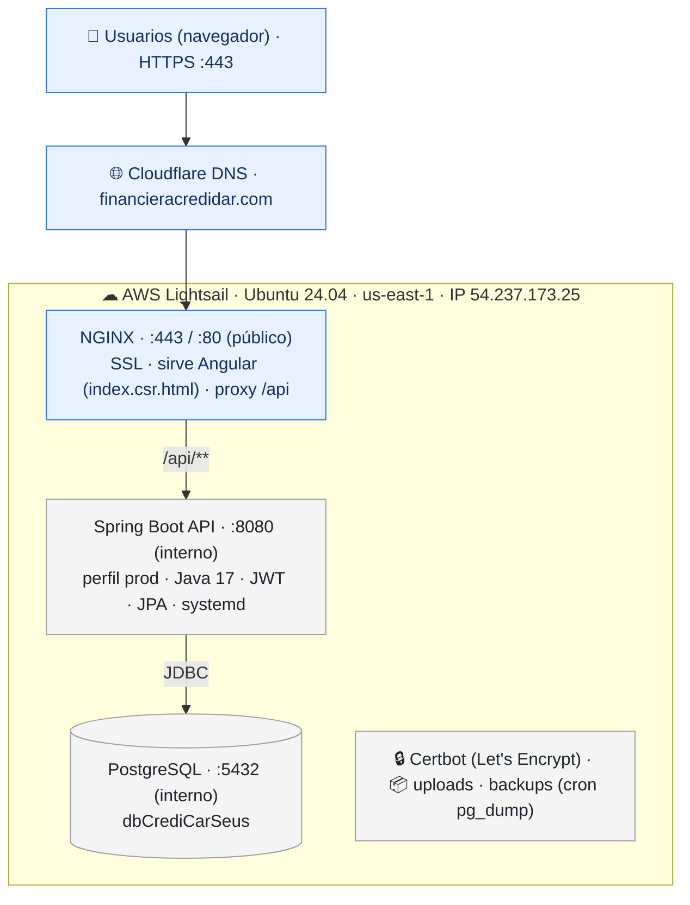
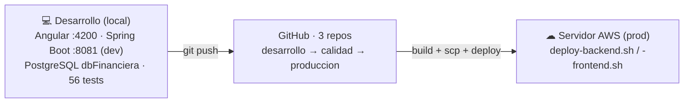

# Arquitectura de Despliegue — ¿Dónde está el sistema?

> Vista general de **dónde corre** el sistema financiero y **cómo llega ahí**. Para el detalle
> operativo paso a paso ver: [`despliegue-credidar-aws.md`](./despliegue-credidar-aws.md)
> (servidor en vivo), [`ambientes.md`](./ambientes.md) (dev/qa/prod) y
> [`arquitectura-produccion-nginx.md`](./arquitectura-produccion-nginx.md) (plan EC2 + Docker).

---

## 1. Diagrama

> 🔒 **Regla de red:** solo **Nginx (80/443)** y **SSH (22)** miran a internet. **8080 (Spring Boot)
> y 5432 (PostgreSQL) son internos** — el navegador nunca habla directo con la API ni la BD.

### Flujo de despliegue (manual)

---

## 2. Componentes y puertos

| Componente | Puerto | ¿Público? | Responsabilidad |
|---|---|---|---|
| **Cloudflare DNS** | — | ✅ | Resuelve el dominio (registros A, **DNS only**) |
| **Nginx** | 443 / 80 | ✅ | SSL/TLS, sirve Angular estático, proxy `/api`, gzip, headers |
| **Spring Boot** | 8080 | ❌ interno | API REST, JWT, lógica de negocio, JPA (perfil `prod`, Java 17, systemd) |
| **PostgreSQL** | 5432 | ❌ interno | Persistencia (`dbCrediCarSeus`) |
| **Certbot** | — | — | Renovación automática del certificado Let's Encrypt |

**Servidor:** AWS Lightsail · `servidor-angular-java` · Ubuntu 24.04 LTS · us-east-1a · 4 GB RAM /
2 vCPU / 80 GB SSD · IP `54.237.173.25`.

---

## 3. Ambientes

| Ambiente | Rama | Base de datos | Perfil | Frontend |
|---|---|---|---|---|
| **Desarrollo** (local) | `desarrollo` | `dbFinanciera` (:5432) | `dev` (:8081) | `ng serve` (:4200) |
| **Calidad** (QA) | `calidad` | `dbFinanciera_qa` | `qa` (:8082) | `ng build --configuration qa` |
| **Producción** (AWS) | `produccion` | `dbCrediCarSeus` | `prod` (:8080, tras Nginx) | `ng build` white-label |

---

## 4. White-label (una base, varias marcas)

Un mismo backend sirve varias marcas (el branding se aplica en el build de Angular):

| Marca | Estado |
|---|---|
| **CrediDar** | ✅ en vivo — `https://financieracredidar.com` 🔒 (AWS Lightsail) |
| **CrediActiva** | demo en el servidor de Reelige |
| **CrediCash** | nuevo cliente (brand creado) |
| **Reelige** | marca base / entorno de demos |

---

## 5. Plan a futuro (documentado, aún no implementado)

[`arquitectura-produccion-nginx.md`](./arquitectura-produccion-nginx.md) propone migrar a
**AWS EC2 + Docker Compose** (Nginx + Spring Boot + PostgreSQL en contenedores) y, para datos
financieros, **PostgreSQL en AWS RDS** (backups automáticos point-in-time, fuera del EC2).

---

*Documento de referencia — 2026-06-13. Refleja el despliegue real (CrediDar en AWS Lightsail) y
el pipeline dev → GitHub → producción.*
