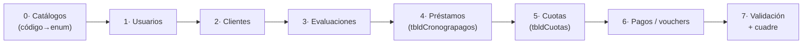

# Migración Zeus → Reelige

> **Objetivo:** migrar los datos del sistema legado **Zeus** (SQL Server 2017,
> `DatabaseZeus`) al sistema **Reelige** (PostgreSQL / Spring Boot). Documento vivo:
> mapeo de esquemas, hallazgos, estrategia y plan de carga.
>
> ⚠️ **Seguridad:** la cadena de conexión a Zeus contiene credenciales `sa` en texto plano.
> No versionar ese archivo en el repo; tratar Zeus como **solo lectura** durante todo el
> proceso y rotar la contraseña al terminar.

---

## 1. Panorama

| | **Zeus (origen)** | **Reelige (destino)** |
|---|---|---|
| Motor | SQL Server 2017 Express | PostgreSQL |
| Convención | `tblm*` (maestro) / `tbld*` (detalle), español sin normalizar | snake_case, JPA/Hibernate |
| IDs | claves de negocio (`nchar`/`char`, p. ej. `idcliente` 11, `idusuario` 7) | `IDENTITY` numérico (`BIGSERIAL`) |
| Volumen total | 3.057 clientes · 20.844 evaluaciones · 20.253 cronogramas · 649.703 cuotas · 257.093 vouchers | vacío (sin datos en prod) |
| **Alcance a migrar (vigente)** | **1.168 clientes · 1.271 préstamos · 20.239 cuotas pendientes** | — |

> 🎯 **Alcance "solo vigente" (decidido):** un crédito está vigente si `croestado=1` **y**
> tiene al menos una cuota pendiente (`couestado=0`). Eso reduce el universo de 650K cuotas a
> ~20K cuotas pendientes de 1.271 créditos vivos — una migración mucho más limpia y rápida.

**Equivalencia de dominios** (clave para entender todo el resto):

```
Zeus tblmCliente            → Reelige clientes
Zeus tblmEvaluacioncredito  → Reelige evaluacion_credito (+ origina el préstamo)
Zeus tbldCronograpagos      → Reelige prestamos        (cabecera: monto, tasa, plazo, desembolso)
Zeus tbldCuotas             → Reelige cronograma_pagos  (línea por cuota)
Zeus tbldvoucher            → Reelige pagos / movimientos de caja (cobranzas)
Zeus tblmUsuario (+cargo)   → Reelige usuarios (+ rol)
```

> En Zeus, **el "cronograma" (`tbldCronograpagos`) es realmente el préstamo desembolsado**:
> una fila por crédito con su monto, tasa, TEA, plazo y fecha de desembolso. Las cuotas
> individuales viven en `tbldCuotas` apuntando a `idcronograma`. En Reelige eso se separa
> en `prestamos` (cabecera) + `cronograma_pagos` (líneas).

---

## 2. Hallazgos críticos (decisiones requeridas)

| # | Hallazgo | Impacto | Propuesta |
|---|---|---|---|
| **M-01** | `tblmUsuario.usupassword` es `nchar(32)` → **hash MD5**, no BCrypt. | Las contraseñas **no se pueden migrar**. | Migrar usuarios con `requiere_cambio_password = true` y un hash BCrypt temporal aleatorio; reset obligatorio en primer login. |
| **M-02** | Apellidos en **un solo campo** (`cliapellidos`, `usuapellidos`). Reelige exige `paternal_last_name` + `maternal_last_name` separados. | Riesgo de datos mal partidos. | Split heurístico (1er token = paterno, resto = materno) + **columna de revisión manual** para casos ambiguos. |
| **M-03** | Reelige **no tiene columna `legacy_id`** en las entidades. | Sin trazabilidad origen→destino ni idempotencia (re-correr duplicaría). | Añadir `legacy_id` (texto) a `clientes`, `prestamos`, `cronograma_pagos`, `usuarios`, `evaluacion_credito` **o** usar tablas de mapeo en un esquema `migracion`. → ver §5. |
| **M-04** | Muchos campos son **códigos `int`** (`cliestadocivil`, `iddocumento`, `estado`, `sector`, `destino`, `crotipopago`, `croestado`). | No se pueden interpretar sin los catálogos. | Extraer los diccionarios de Zeus (`tbldModulos`, tablas de catálogo) y construir tablas de equivalencia código→enum de Reelige. |
| **M-05** | `idcliente` es `nchar(11)` — posiblemente derivado del documento; confirmar unicidad y relación con `clinumdoc`. | Define la clave natural para deduplicar. | Validar `COUNT(DISTINCT idcliente)` vs `clinumdoc`; elegir clave de deduplicación. |
| **M-06** | Estados son `bit` (`croestado`, `couestado`, `usuestado`, `estadomora`). | Semántica binaria → enums de Reelige (`PENDIENTE/PAGADO/VENCIDO`, `VIGENTE/LIQUIDADO`). | Definir reglas: `couestado=1` → `PAGADO`; `estadomora=1` + pendiente → `VENCIDO`; etc. |
| **M-07** | Reelige aplica **invariantes de dinero** (D1–D7). Los datos legados pueden no cuadrar. | Migrar "tal cual" puede romper validaciones. | Migrar con `@CreatedDate` histórico y **modo carga** (sin recalcular); validar cuadre por muestreo, no por recálculo. |

---

## 3. Matriz de mapeo — campo por campo

### 3.1 `tblmCliente` → `clientes`

| Zeus | Tipo | → Reelige | Transformación |
|---|---|---|---|
| `idcliente` | nchar(11) | *(legacy_id)* | clave de mapeo, no se copia al PK |
| `clinumdoc` | nvarchar(50) | `dni_cuit` | trim; clave única |
| `iddocumento` | int | `document_type` | catálogo código→enum `DocumentType` |
| `clinombres` | nvarchar(150) | `first_name` | trim |
| `cliapellidos` | nvarchar(150) | `paternal_last_name` + `maternal_last_name` | **split M-02** |
| `cliemail` | nvarchar(250) | `email` | nullable |
| `clisexo` | bit | `gender` | 0/1 → `FEMENINO/MASCULINO` |
| `clifechanacimiento` | date | `birth_date` | directo |
| `cliestadocivil` | int | `estado_civil` | catálogo código→enum |
| `clitelefono`/`clicelular` | nvarchar(9) | `phone_number` | preferir celular |
| `idsucursal` | nchar(3) | `agencia_id` + `agencia_nombre` | catálogo sucursal→agencia |
| `conapellido`,`connombre` | nvarchar | `conyuge_nombre` | concatenar |
| `condni` | nvarchar(50) | `conyuge_dni` | trim |
| `direccionact` | nvarchar(300) | `address` / `direccion_negocio` | |
| `renombre1/2`,`revinculo1/2`,`retelefono1/2` | nvarchar | `phone_references` (jsonb) | armar array JSON |
| `cliregistrodate`+`cliregistrotime` | date+time | `created_at` | combinar |

### 3.2 `tblmEvaluacioncredito` → `evaluacion_credito`

| Zeus | → Reelige | Nota |
|---|---|---|
| `idevaluacion` | *(legacy_id)* | clave de mapeo |
| `idcliente` | `customer_id` (FK) | vía tabla de mapeo de clientes |
| `montopres` | monto solicitado | decimal |
| `estado` (int) | estado evaluación | catálogo |
| `idusuario` | analista (FK usuarios) | vía mapeo de usuarios |
| `idsucursal` | agencia | catálogo |
| `sector`,`destino`,`modalidad` (int) | campos de destino/sector | catálogo |
| `obsevaluacion`,`obsgarantia`,`obsinventario` | observaciones | texto |
| `foto01..10` | adjuntos | URLs de evidencia |

### 3.3 `tbldCronograpagos` → `prestamos`

| Zeus | → Reelige | Nota |
|---|---|---|
| `idcronograma` | *(legacy_id)* / base de `numero_contrato` | |
| `idevaluacion` | `evaluacion_id` (FK) | |
| `cromonto` | `monto_desembolsado` | decimal |
| `crotasa` | `tasa_interes_periodo` | tasa por período |
| `crotea` | `tasa_interes_anual` | TEA |
| `crocuotas` | `numero_cuotas` / `plazo_meses` | según frecuencia |
| `crodiaplazo` | `frecuencia_pago` | días entre cuotas → DIARIO/SEMANAL/… |
| `crogracia` | `periodo_gracia` | |
| `crofchdesembolso` | `fecha_desembolso` | |
| `croestado` (bit) | `estado_prestamo` | **M-06**: derivar VIGENTE/LIQUIDADO |
| `crotipopago` (int) | `sistema_calculo` | catálogo |
| `banco`,`numoperacion`,`cuenta` | `banco_id`,`referencia_transferencia`,`canal_desembolso` | |
| `interesneto`,`crointeresredondeo` | snapshot interés | |

### 3.4 `tbldCuotas` → `cronograma_pagos`

| Zeus | → Reelige | Nota |
|---|---|---|
| `idcouta` | *(legacy_id)* | |
| `idcronograma` | `prestamo_id` (FK) | vía mapeo de préstamos |
| `counum` | `numero_cuota` | |
| `coufechapago` | `fecha_vencimiento` | |
| `coucapital` | `saldo_inicial` | revisar semántica vs `saldo_final` |
| `couamortizacion` | `amortizacion` | |
| `couinteres` | `interes` | |
| `coucomosion` | `seguro` / comisión | mapear según uso |
| `couredondeo` | ajuste de redondeo | sumar a cuota_total |
| `couestado` (bit) | `estado` | 1→PAGADO, 0→PENDIENTE (+VENCIDO si `estadomora`) |
| `coufechacancelacion` | `fecha_pago` | |
| `couadelantomonto` | `monto_pagado` | |

### 3.5 `tblmUsuario` → `usuarios`

| Zeus | → Reelige | Nota |
|---|---|---|
| `idusuario` (char 7) | *(legacy_id)* | |
| `usunombre` | `first_name` | |
| `usuapellidos` | `paternal/maternal_last_name` | split M-02 |
| `usudni` (char 8) | `dni_cuit` | |
| `usuusuario` | `username` | único |
| `usupassword` (MD5) | `password_hash` | **M-01: NO migrar**; BCrypt temporal + reset |
| `usuestado` (bit) | `estado` | 1→ACTIVO, 0→INACTIVO |
| `idsucursal` | `agencia_id` | catálogo |
| `monto` | `monto_maximo_aprobacion` | |
| *(tbldusercargo)* | `rol` (RolUsuario) | catálogo cargo→enum |

> `tbldvoucher` (pagos/cobranza) → `pagos` + movimientos de caja: es el flujo más complejo
> (mora, adelantos, comisiones, devoluciones). Se aborda en una **fase posterior** una vez
> validada la migración de clientes/préstamos/cuotas.

---

## 4. Catálogos a extraer de Zeus (M-04)

Antes de migrar hay que decodificar los `int`. Extraer y mapear:

- Estado civil (`cliestadocivil`)
- Tipo de documento (`iddocumento`)
- Sucursal → Agencia (`idsucursal`)
- Sector / destino / modalidad de crédito
- Tipo de pago / sistema de cálculo (`crotipopago`)
- Cargo de usuario → `RolUsuario`
- Bancos (`banco`)

→ Origen probable: `tbldModulos`, `tbldProcesocuenta`, tablas de catálogo aún por inventariar.

---

## 5. Estrategia de carga

**Principios**

1. **Zeus solo lectura.** Nunca escribir en el legado.
2. **Idempotente.** Re-ejecutar no duplica → cada registro destino guarda su `legacy_id`
   (decisión M-03) y la carga hace *upsert* por esa clave.
3. **Orden por dependencias** (respetar FKs):



4. **Staging primero.** Volcar Zeus a un esquema `staging` en PostgreSQL (copia cruda) y
   transformar con SQL/ETL hacia las tablas finales — más fácil de auditar que ETL directo.
5. **Modo carga sin recalcular (M-07).** Insertar montos/saldos/estados tal cual; no disparar
   la lógica de negocio (mora, cuadre) durante la inserción. Validar al final.
6. **Probar en DEV primero.** Toda la migración se ensaya contra `dbFinanciera` (dev) y se
   valida; recién entonces se considera prod.

**Herramienta sugerida:** script ETL (Python con `pyodbc` + `psycopg2`, o un job Spring Boot
de migración) que lea Zeus, transforme y haga upsert. Las tablas de mapeo `legacy_id → id`
viven en un esquema `migracion`.

**Validaciones de cierre (cuadre):**

- `COUNT` por tabla origen vs destino (clientes, préstamos, cuotas).
- Σ `cromonto` (Zeus) == Σ `monto_desembolsado` (Reelige).
- Σ cuotas por préstamo == monto + interés del préstamo (muestreo).
- Nº de cuotas por préstamo coincide con `crocuotas`.
- Spot-check de 20 créditos completos (cliente→préstamo→cronograma→pagos).

---

## 6. Plan por fases

| Fase | Entregable | Estado |
|---|---|---|
| **0** | Inventario completo de tablas + catálogos de Zeus | 🟡 núcleo mapeado; faltan catálogos |
| **1** | Decisiones M-01…M-07 confirmadas con negocio | 🔴 pendiente |
| **2** | Esquema `staging` + `migracion` (legacy_id / mapeo) en dev | 🔴 pendiente |
| **3** | ETL catálogos → usuarios → clientes (validado en dev) | 🔴 pendiente |
| **4** | ETL evaluaciones → préstamos → cuotas (validado en dev) | 🔴 pendiente |
| **5** | ETL pagos/vouchers + cuadre | 🔴 pendiente |
| **6** | Validación integral + ensayo de corte a prod | 🔴 pendiente |

---

## 7. Decisiones tomadas (2026-06-15)

| Tema | Decisión |
|---|---|
| **Alcance** | **Solo activo / vigente**: clientes activos + créditos vigentes con su cronograma pendiente. El histórico cerrado se queda en Zeus para consulta. |
| **Trazabilidad (M-03)** | **Esquema `migracion` aparte**: tablas de mapeo `legacy_id → id`. No se modifican las entidades de Reelige; el esquema se puede descartar al terminar. |
| **Siguiente paso** | **Extraer los catálogos de Zeus** (M-04) para decodificar los `int`. |

### Preguntas aún abiertas para negocio
1. ¿Cómo se asignan los **roles** Reelige a los cargos de Zeus? (M-04 — `tbldusercargo`)
2. ¿Política de **deduplicación** de clientes — por DNI? (M-05)
3. ¿Los pagos históricos (`tbldvoucher`) entran ahora o en una segunda ola? (con alcance "solo vigente", probablemente solo cuotas pendientes)

---

## 8-bis. Resultado del PILOTO (ejecutado 2026-06-15)

> ✅ **Migración piloto ejecutada con éxito** contra el servidor cloud
> `ubuntu@50.16.139.45` (BD `dbReeligeSeus`, PostgreSQL 16, backend Reelige ya desplegado),
> vía **túnel SSH** (local → `localhost:5432`). ETL en Python (`pyodbc` lee Zeus, `psycopg2`
> escribe el piloto), en `C:\Proyectos\Reelige\migracion-zeus\`.

### Cargado

| Entidad | Zeus (vigente) | Migrado | Tabla destino |
|---|---|---|---|
| Usuarios | 43 filas (40 DNIs) | **40** (+ dedup) | `usuarios` |
| Clientes | 1.169 | **1.169** | `clientes` |
| Evaluaciones | 1.274 | **1.273** | `evaluaciones_credito` |
| Préstamos | 1.274 | **1.273** | `prestamos` |
| Cuotas (cronograma completo) | 31.881 | **31.842** | `cronograma_pagos` |

### Cuadre (Zeus vs piloto)

| Métrica | Zeus | Piloto | Δ |
|---|---|---|---|
| Préstamos vigentes | 1.274 | 1.273 | −1 (solapa con préstamo demo) |
| Σ monto desembolsado | 1.526.127,50 | 1.525.427,50 | −700,00 (ese préstamo) |
| Cuotas | 31.881 | 31.842 | −39 (fecha nula) −1 préstamo |

Spot-check de 3 préstamos al azar: **nº de cuotas y Σ amortización idénticos** al céntimo.
Estados del cronograma: 20.258 PENDIENTE · 11.581 PAGADO · 3 VENCIDO.

### Supuestos y limitaciones del piloto (a refinar antes de prod)

- **Passwords:** todos los usuarios migrados con bcrypt temporal `Reelige.2026` +
  `requiere_cambio_password=true` (M-01).
- **sistema_calculo:** por defecto `SIMPLE_SALDO` (Zeus no lo expone limpio); las cuotas
  llevan el detalle real de amortización/interés, así que el cronograma es fiel.
- **frecuencia_pago / plazo_meses:** derivados de `crodiaplazo` y `crocuotas`.
- **Mora (VENCIDO):** Zeus la calcula dinámicamente (no la guarda) → solo 3 marcadas por el
  bit `estadomora`. **Reelige la recalcula** con su `MoraCalculator`, así que no se pierde.
- **39 cuotas** omitidas por `fecha_vencimiento` nula en Zeus (basura).
- **Agencia CIU** (Ciudad Universitaria) mapeada a `Agencia Pilcomayo` (id 8) por falta de
  equivalente; **estado civil código 3** → `CONVIVIENTE`.
- **Datos sucios detectados** en Zeus: usuario con DNI placeholder `00000000`, cuenta
  `SYSTEM DEVELOPER`, DNIs de usuario duplicados (deduplicados por DNI en la carga).
- **Idempotencia:** todo el mapeo `legacy_id → id` vive en el esquema `migracion`
  (`map_usuario/cliente/evaluacion/prestamo/cuota`); re-correr no duplica.

### Cómo re-ejecutar
```
# túnel:  ssh -i FS-FinanceReelige-Key.pem -N -L 55432:localhost:5432 ubuntu@50.16.139.45
cd C:\Proyectos\Reelige\migracion-zeus
python 00_schema_migracion.py   # esquema de mapeo
python 01_usuarios.py
python 02_clientes.py
python 03_evaluaciones.py
python 04_prestamos.py
python 05_cuotas.py
python 06_validar.py            # cuadre
```

---

## 8. Catálogos decodificados (M-04) — extraídos de Zeus

> Zeus tiene **136 tablas**; estos son los diccionarios que decodifican los `int`. Valores
> reales leídos de la BD el 2026-06-15.

### Tipo de documento — `iddocumento` → `DocumentType`
| Zeus | Nombre | → Reelige |
|---|---|---|
| 0 | DNI | `DNI` |
| 1 | CARNET EXT. | `CE` |
| 2 | PASAPORTE | `PASAPORTE` |
| 3 | C.I.P | `CE` ⚠️ (no hay equivalente exacto; revisar — pocos casos) |

### Estado civil — `cliestadocivil` → `EstadoCivil` (Soltero/Casado/Divorciado/Viudo)
| Zeus | n | → Reelige (tentativo, **confirmar con negocio**) |
|---|---|---|
| 1 | 731 | `Soltero` |
| 2 | 1.380 | `Casado` |
| 3 | 860 | ⚠️ probablemente *Conviviente* — Reelige no lo tiene → `Soltero` o ampliar enum |
| 4 | 48 | `Divorciado` |
| 5 | 38 | `Viudo` |

> ⚠️ El código 3 (860 clientes) no encaja en el enum actual de 4 valores. **Decisión de negocio
> requerida:** ¿añadir `Conviviente` al enum o mapear a `Soltero`?

### Forma de pago — `crodiaplazo`/`tbldFormadepago` → `frecuencia_pago`
| Zeus | → Reelige |
|---|---|
| 1 | `DIARIO` · 2 `SEMANAL` · 3 `QUINCENAL` · 4 `MENSUAL` |

### Producto — `tbldProducto`
`100 DIARIO · 101 INTERDIARIO · 102 SEMANAL · 103 OTROS` → mapear a `producto_credito` / `tipo_credito`.

### Tipo de operación — `tipooperacion` (`tbldTipooperacion`)
`100 NUEVO PRESTAMO · 101 REPRESTAMO · 102 AMPLIACION · 103 REPROGRAMACION · 104 REFINANCIACION`
→ marca `es_recurrente` (≠100) en `prestamos`.

### Tipo de crédito — `tbldTipocredito`
`100 COMERCIAL · 101 MES · 102 CONSUMO`.

### Clasificación de riesgo — `tbldRiesgo`
`100 NORMAL · 101 CPP · 102 DEFICIENTE · 103 DUDOSO · 104 PERDIDA` (SBS estándar).

### Sucursal → Agencia — `tblmSucursal` (`idsucursal` nchar 3)
| Zeus | Nombre | → `agencia_id` / `agencia_nombre` |
|---|---|---|
| CHU | CHUPACA | mapear a agencia Reelige |
| CIU | CIUDAD UNIVERSITARIA | mapear a agencia Reelige |
| JAU | JAUJA | mapear a agencia Reelige |

### Cargo → Rol — `tbldCargo` + `tbldusercargo` → `RolUsuario`
| Zeus cargo | → Reelige `RolUsuario` (propuesto, **confirmar**) |
|---|---|
| 1 ADMINISTRADOR | `ADMINISTRADOR` |
| 10 ASESOR | `ANALISTA_CREDITO` |
| 11 EJECUTIVO DE OPERACIONES | `CAJERO_COBRANZA` |
| 12 ENCARGADO | `GERENTE_AGENCIA` |

### Estados (bit) decodificados
| Campo | Valor | Significado | → Reelige |
|---|---|---|---|
| `croestado` | 1 / 0 | activo / anulado | `estado_prestamo` VIGENTE / (excluir) |
| `couestado` | 1 / 0 | pagada / pendiente | `estado` PAGADO / PENDIENTE |
| `estadomora` | 1 | en mora | `estado` → VENCIDO si además pendiente |

---

*Documento de migración — creado 2026-06-15, actualizado con alcance vigente y catálogos
decodificados. Origen leído del esquema real de `DatabaseZeus`. Próximo paso: confirmar
estado civil código 3 y mapeo de cargos→roles, luego montar el esquema `staging`/`migracion`
en dev.*
