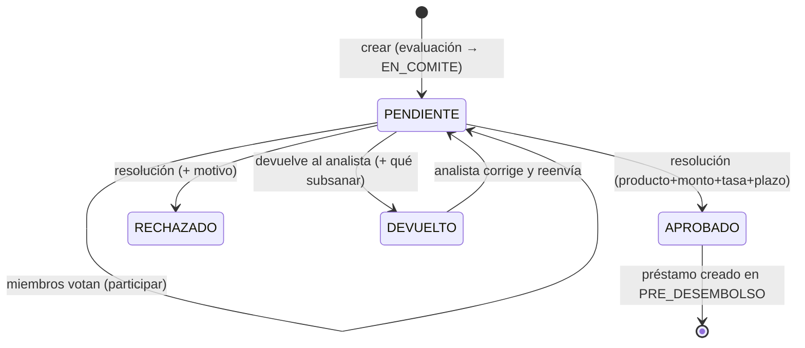

# RN-APRO · Aprobación y Comité

> Tras la evaluación, el crédito va al **comité**: los miembros votan, se define la **resolución
> final** (producto, monto, tasa, plazo) y, si se aprueba, se crea automáticamente el préstamo en
> `PRE_DESEMBOLSO` con su cronograma preliminar.
>
> Fuente en código: `model/AprobacionCredito.java`, `service/AprobacionCreditoServiceImpl.java`,
> **`utils/PrestamoCalculator.java`** (motor del cronograma persistido).

---

## 1. Propósito

Gestionar la decisión colegiada del crédito y, al aprobar, instanciar el préstamo con las
condiciones finales y su cronograma.

---

## 2. Diagrama — Estados de la aprobación

> Estados reales (`estadoAprobacion`): `PENDIENTE`, `APROBADO`, `RECHAZADO`, `DEVUELTO`.

---

## 3. Reglas — Comité y resolución

| ID | Regla | Fuente |
|---|---|---|
| **RN-APRO-01** | Crear aprobación requiere `presidenteId`; pasa la evaluación a `EN_COMITE` y la aprobación a `PENDIENTE` | `crear()` |
| **RN-APRO-02** | Cada miembro registra **voto + checklist + comentario** (`participarMiembro`) | `:173-208` |
| **RN-APRO-03** | Enviar a comité: `ADMIN`, `GERENTE_AGENCIA`, `SUPERVISOR`, `ANALISTA`; decidir: `ADMIN`, `COMITE`, `ANALISTA` | `@PreAuthorize` |
| **RN-APRO-04** | Una aprobación ya `APROBADO`/`RECHAZADO` **no puede editarse** | `actualizar()` :240 |
| **RN-APRO-05** 💰 | Para **APROBAR** se exige producto, monto, tasa y plazo **finales** (si falta → `IllegalArgumentException`) | `actualizar()` :252 |
| **RN-APRO-06** | Para **RECHAZAR/DEVOLVER** se exige comentario (motivo / qué subsanar) | `actualizar()` :260 |
| **RN-APRO-07** | El presidente (sección 5) ajusta monto y tasa, **no cambia el producto** acordado por el comité | `crearPrestamoDesdeAprobacion` comentario |

> ℹ️ **Quórum / desempate:** los votos se registran por miembro, pero la resolución
> (`actualizar`) **no valida quórum** en el código actual — la decisión final se aplica con los
> campos finales. (La idea de "mínimo quórum" de la doc previa no está implementada.)

---

## 4. Reglas — Creación del préstamo (al aprobar)

| ID | Regla | Fuente |
|---|---|---|
| **RN-APRO-08** | Al aprobar se crea el préstamo en `PRE_DESEMBOLSO`, **idempotente** (no duplica si ya existe) | `:323-328` |
| **RN-APRO-09** | Copia condiciones finales: `montoDesembolsado`, `plazoMeses`, producto, y **snapshot** de gracia y regla de mora del producto | `crearPrestamoDesdeAprobacion` |
| **RN-APRO-10** | `saldoCapital = montoFinalAprobado`; `fechaPrimerVencimiento = hoy + 1 mes` (ajustable); genera **N° de contrato** | `:427-431` |
| **RN-APRO-11** | Genera el **cronograma preliminar** con `PrestamoCalculator` según `sistemaCalculo` | `:438` |

---

## 5. ⚠️ Hallazgos detectados

### HALL-11 — La tasa aprobada por el comité no se aplica en productos SIMPLE
- **Severidad:** 🔴 Alta (dinero) · **Estado:** 🔍 En análisis
- Al crear el préstamo: `tasaInteresAnual = tasaFinalAprobada` (comité) pero
  `tasaInteresPeriodo = producto.getTasaInteres()` (producto).
- El cronograma (`PrestamoCalculator`) lee:
  - `FRANCES`/`ALEMAN` → `tasaInteresAnual` → **usa la tasa aprobada** ✅
  - `SIMPLE_FLAT`/`SIMPLE_SALDO` → `tasaInteresPeriodo` → **usa la del producto, ignora la aprobada** ⚠️
- **Impacto:** si el comité aprueba una tasa distinta a la del producto, en créditos SIMPLE
  (los de microcrédito) **el cliente paga con la tasa del producto, no la aprobada**.
- **Acción propuesta:** confirmar la intención (¿tasa fija por producto en SIMPLE?). Si la tasa
  del comité debe mandar, asignar `tasaInteresPeriodo = tasaFinalAprobada` en SIMPLE; blindar con
  prueba que compare la tasa aprobada vs la del cronograma.

### HALL-09 (ampliado) — Hay **tres** motores de cálculo de cuotas
- `PrestamoCalculator` (cronograma persistido, +ALEMAN) · `ProductoCalculator` (simulación) ·
  `CalculoCuotasServiceImpl` (legacy, enum incompatible). Los dos primeros **duplican** la lógica
  FLAT/SALDO/FRANCES; el tercero es huérfano. → Riesgo de divergencia y mantenimiento.

---

## 6. Casos borde / negativos

| Caso | Resultado |
|---|---|
| Aprobar sin producto/monto/tasa/plazo final | `IllegalArgumentException` (RN-APRO-05) |
| Rechazar/devolver sin comentario | `IllegalArgumentException` (RN-APRO-06) |
| Editar una aprobación ya resuelta | `IllegalStateException` (RN-APRO-04) |
| Aprobar dos veces | no duplica el préstamo (RN-APRO-08) |

---

## 7. Trazabilidad (regla → prueba)

| Regla | Prueba | Estado |
|---|---|---|
| RN-APRO-05 (aprobar exige finales) | `FlujoNegativoTest.aprobar_sinProductoFinal…` | ✅ |
| RN-APRO-08..11 (crea préstamo + cronograma) | `FlujoPrestamoIntegrationTest` | ✅ |
| RN-APRO-03 (permisos comité) | `RbacIntegrationTest` (parcial) | 🟡 |
| HALL-11 (tasa aprobada vs cronograma SIMPLE) | _pendiente (clave 🔴)_ | ❌ |

---

## Changelog
- **2026-06-12** — Documento nuevo desde el código: estados de aprobación, reglas RN-APRO-01..11,
  creación idempotente del préstamo y cronograma con `PrestamoCalculator`. Detecta **HALL-11**
  (tasa aprobada ignorada en productos SIMPLE) y amplía **HALL-09** (tres motores de cálculo).
  Aclara que el **quórum no está implementado** (corrige la doc previa).
