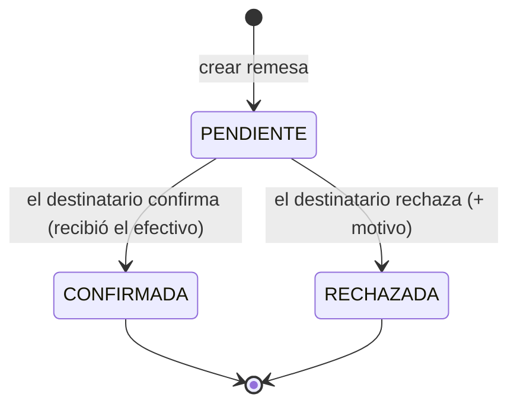

# RN-BOV · Bóveda / Tesorería (habilitación de efectivo)

> La bóveda mueve el **efectivo** entre tesorería, las agencias y los cajeros mediante **remesas**.
> Es lo que **alimenta la apertura de caja**: un cajero solo abre caja con una habilitación
> CONFIRMADA. Conecta con [RN-CAJA](./caja.md).
>
> Fuente en código: `model/RemesaBoveda.java`, `service/BovedaServiceImpl.java`,
> `repository/RemesaBovedaRepository.java`.

---

## 1. Propósito

Controlar el flujo de efectivo de la entidad: tesorería habilita agencias, las agencias habilitan
cajeros, y los cajeros devuelven el sobrante — todo con un circuito de **solicitud → confirmación**.

---

## 2. Diagrama — Estados de una remesa

> Estados reales (`RemesaBoveda.EstadoRemesa`): `PENDIENTE`, `CONFIRMADA`, `RECHAZADA`.

---

## 3. Tipos de remesa y quién confirma

| Tipo | Movimiento | Confirma |
|---|---|---|
| `HABILITACION_AGENCIA` | Tesorería → agencia | Gerente/Supervisor de la agencia destino (o admin) |
| `REMESA_AGENCIA_TESORERIA` | Agencia → tesorería | Admin / Gerente General |
| `HABILITACION_CAJERO` | Bóveda de agencia → **cajero** | El **cajero destinatario** (o admin) |
| `DEVOLUCION_CAJERO` | Cajero → bóveda de agencia | Gerente/Supervisor de la agencia (o admin) |

---

## 4. Reglas

| ID | Regla | Fuente |
|---|---|---|
| **RN-BOV-01** | Al **crear** una remesa queda en `PENDIENTE`; el monto puede venir del billetaje detallado | `crear()` |
| **RN-BOV-02** | Solo se puede **confirmar/rechazar** una remesa `PENDIENTE` (no dos veces) | `validarEstadoPendiente` |
| **RN-BOV-03** | Solo el **destinatario esperado** del tipo (o admin) puede confirmar/rechazar | `validarPermisosConfirmacion` |
| **RN-BOV-04** | Confirmar → `CONFIRMADA` (guarda quién y cuándo); rechazar → `RECHAZADA` (+ motivo) | `confirmar()` / `rechazar()` |
| **RN-BOV-05** 💰 | Las `HABILITACION_CAJERO` **CONFIRMADAS** son las que el cajero usa para **abrir caja** | `habilitacionesDisponibles()` → [RN-CAJA-01](./caja.md) |

---

## 5. Casos borde / negativos

| Caso | Resultado |
|---|---|
| Confirmar una remesa ya CONFIRMADA/RECHAZADA | `IllegalStateException` ("ya fue …") |
| Un cajero confirma una habilitación que no es suya | `IllegalStateException` ("No tienes permiso") |
| Tipo de remesa no soportado | `IllegalArgumentException` |

---

## 6. Trazabilidad (regla → prueba)

| Regla | Prueba | Estado |
|---|---|---|
| RN-BOV-01 (crear → PENDIENTE) | `BovedaRemesaTest.crearHabilitacion_quedaPendiente` | ✅ |
| RN-BOV-04/05 (confirmar → disponible) | `BovedaRemesaTest.cajeroConfirmaSuHabilitacion_quedaConfirmadaYDisponible` 🐘 | ✅ |
| RN-BOV-02 (no doble confirmación) | `BovedaRemesaTest.noSePuedeConfirmarDosVeces` | ✅ |
| RN-BOV-03 (solo el destinatario) | `BovedaRemesaTest.otroCajeroNoPuedeConfirmar` | ✅ |

> 🐘 = requiere PostgreSQL real (Testcontainers): la consulta de habilitaciones disponibles usa
> SQL nativo PG.

---

## Changelog
- **2026-06-13** — Documento nuevo desde el código: estados de la remesa, tipos y quién confirma,
  reglas RN-BOV-01..05 y la conexión con la apertura de caja. Cubierto por `BovedaRemesaTest`.
