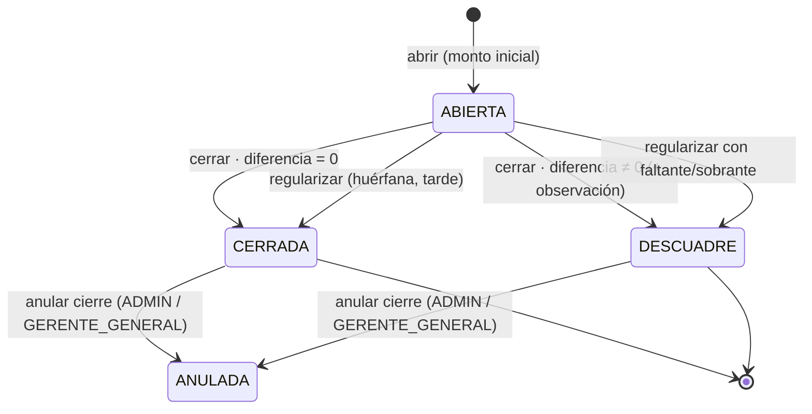

# RN-CAJA · Caja (apertura, cierre y cuadre)

> **Corazón del dinero.** Toda entrada y salida de efectivo pasa por la caja de un cajero. Aquí
> viven las invariantes críticas: el saldo siempre se calcula desde los movimientos y el cierre
> obliga a que el efectivo contado coincida con el teórico.
>
> Fuente en código: `service/CajaServiceImpl.java`, `model/AperturaCaja.java`,
> `controller/CajaController.java`, `service/ParametroSistemaService`.
> Invariantes relacionadas: 💰 D1 (conservación), D4 (cuadre), D6 (no hay dinero sin caja).

---

## 1. Propósito

Controlar el ciclo diario de la caja del cajero: abrir con un monto inicial, registrar
ingresos/egresos durante el día (ver [RN-MOV](./movimientos-caja.md)), y cerrar con arqueo
comparando el efectivo **contado** contra el **teórico** del sistema.

---

## 2. Diagrama — Estados de la caja



> Estados reales (`AperturaCaja.EstadoCaja`): `ABIERTA`, `CERRADA` (cierre limpio, dif=0),
> `DESCUADRE` (dif≠0), `ANULADA` (reabierta por admin/gerente general).

---

## 3. Reglas — Apertura

| ID | Regla | Fuente |
|---|---|---|
| **RN-CAJA-01** | La abre el **cajero autenticado**; toma su `cajeroId` y `agenciaId` del contexto | `abrir()` |
| **RN-CAJA-02** | **No se abre** si el cajero tiene una caja **huérfana** sin cerrar de un día anterior | `validarSinCajaHuerfana` |
| **RN-CAJA-03** | **Un cajero, una caja por día** | `existsByCajeroIdAndFecha` → `IllegalStateException` |
| **RN-CAJA-04** | Se registra `montoInicial` y el `billetaje` (desglose de billetes/monedas) | `AperturaCaja` |

---

## 4. Reglas — Cuadre (cómo se calcula el saldo)

> El saldo **nunca** se guarda "a mano": siempre se deriva de los movimientos. Separado por canal.

```
saldoTeóricoEfectivo = montoInicial + Σ ingresos(EFECTIVO) − Σ egresos(EFECTIVO)
saldoTeóricoBanco    =                Σ ingresos(BANCO)    − Σ egresos(BANCO)
saldoTeóricoTotal    = saldoTeóricoEfectivo + saldoTeóricoBanco
```

| ID | Regla | Fuente |
|---|---|---|
| **RN-CAJA-05** | Saldo teórico = `montoInicial + Σingresos − Σegresos` (💰 **D1 conservación**) | `cuadre()`, `cerrar()` |
| **RN-CAJA-06** | El **monto inicial es solo efectivo** (el canal BANCO arranca en 0) | `cuadre()` línea `saldoBanco = ingBanco − egrBanco` |
| **RN-CAJA-07** | El cuadre se desglosa por canal **EFECTIVO** y **BANCO** | `sumIngresosPorAperturaYCanal` |

---

## 5. Reglas — Cierre con arqueo

| ID | Regla | Fuente |
|---|---|---|
| **RN-CAJA-08** | Solo se cierra una caja en estado `ABIERTA` | `cerrar()` |
| **RN-CAJA-09** | Cierra el **dueño** de la caja, o ADMIN/GERENTE/SUPERVISOR | `cerrar()` (`tieneRol`) |
| **RN-CAJA-10** | `diferencia = montoContado − saldoTeórico` (💰 **D4**) | `cerrar()` |
| **RN-CAJA-11** ⭐ | Parámetro `CIERRE_CAJA_BILLETAJE_EXACTO` (**default true**): si hay descuadre, **BLOQUEA el cierre** — ni con observación | `cerrar()` + `ParametroSistemaService` |
| **RN-CAJA-12** | Si el parámetro está **deshabilitado** y hay diferencia → **observación obligatoria** | `cerrar()` |
| **RN-CAJA-13** | Estado final: `CERRADA` si dif=0; `DESCUADRE` si dif≠0 | `cerrar()` |
| **RN-CAJA-14** | Se persiste `saldoTeorico`, `montoContado`, `diferencia`, `observacionCierre` | `cerrar()` |

---

## 6. Reglas — Regularización de caja huérfana

> Caja de un **día anterior** que quedó sin cerrar.

| ID | Regla | Fuente |
|---|---|---|
| **RN-CAJA-15** | Solo regulariza cajas `ABIERTA` de **días anteriores** (la del día usa cierre normal) | `regularizar()` |
| **RN-CAJA-16** ⭐ | Si pasaron **>24h** desde el día original → **solo Gerente Agencia o Admin**; dentro de 24h, el cajero dueño puede | `regularizar()` (`horasDesdeFin > 24`) |
| **RN-CAJA-17** | Si hay diferencia → observación obligatoria | `regularizar()` |
| **RN-CAJA-18** 💰 | Si hay **faltante** (diferencia < 0) → se registra **descuento de planilla** al cajero por el monto | `regularizar()` (`descuentoPlanilla`) |
| **RN-CAJA-19** | Marca `es_cierre_tardio = true` para auditoría | `regularizar()` |

---

## 7. Reglas — Anulación de movimiento / cierre

| ID | Regla | Fuente |
|---|---|---|
| **RN-CAJA-20** | Anular movimiento: no se puede anular uno ya anulado | `eliminar()` |
| **RN-CAJA-21** | Anular movimiento: el **dueño solo del día actual**; ADMIN/GERENTE_GENERAL sin límite de fecha | `eliminar()` |
| **RN-CAJA-22** | La anulación es **lógica** (`anulado=true`, `anuladoPor`, `anuladoAt`), no borra | `eliminar()` |
| **RN-CAJA-23** | **Anular cierre** de caja (→ `ANULADA`): solo ADMIN / GERENTE_GENERAL | `@PreAuthorize` CajaController |

---

## 8. Casos borde / negativos

| Caso | Resultado |
|---|---|
| Abrir con caja huérfana pendiente | rechazado (RN-CAJA-02) |
| Abrir 2da caja el mismo día | `IllegalStateException` (RN-CAJA-03) |
| Cerrar con descuadre y billetaje exacto activo | **bloqueado** (RN-CAJA-11) |
| Cerrar con descuadre, parámetro off, sin observación | rechazado (RN-CAJA-12) |
| Cajero regulariza caja huérfana >24h | rechazado, requiere Gerente/Admin (RN-CAJA-16) |
| Faltante en regularización | descuento de planilla (RN-CAJA-18) |
| Cerrar una caja no `ABIERTA` | `IllegalStateException` (RN-CAJA-08) |

---

## 9. Trazabilidad (regla → prueba)

| Regla | Prueba | Estado |
|---|---|---|
| RN-CAJA-01/04 (apertura básica) | `PagosIntegrationTest.desembolsar()` abre caja | 🟡 indirecto |
| RN-CAJA-03 (una caja por día) | `CajaCierreTest.segundaCajaMismoDia_esRechazada` | ✅ |
| RN-CAJA-05 (saldo teórico, D1) | `CajaCierreTest.cierreCuadrado_quedaCerrada` + `DineroConservacionTest` | ✅ |
| RN-CAJA-10/13 (cuadre dif y estado) | `CajaCierreTest.cierreCuadrado…` / `…quedaDescuadre` | ✅ |
| RN-CAJA-11 (billetaje exacto bloquea) | `CajaCierreTest.cierreDescuadrado_conBilletajeExacto_esBloqueado` | ✅ |
| RN-CAJA-12 (descuadre exige observación) | `CajaCierreTest.…sinObservacion_exigeObservacion` | ✅ |
| RN-CAJA-16 (regularización >24h) | _pendiente_ | ❌ |
| RN-CAJA-18 (descuento por faltante) | _pendiente_ | ❌ |

> 🟢 Cierre/cuadre **ya cubierto** por `CajaCierreTest` (5 escenarios). Quedan pendientes
> regularización >24h (RN-CAJA-16) y descuento por faltante (RN-CAJA-18).

---

## Changelog
- **2026-06-12** — Documento nuevo, extraído del código: estados de caja, fórmula de cuadre por
  canal, reglas RN-CAJA-01..23. Confirmados como **controles correctos** (no bugs) el bloqueo por
  billetaje exacto (V-01) y la regularización >24h restringida a Gerente/Admin (V-03).
