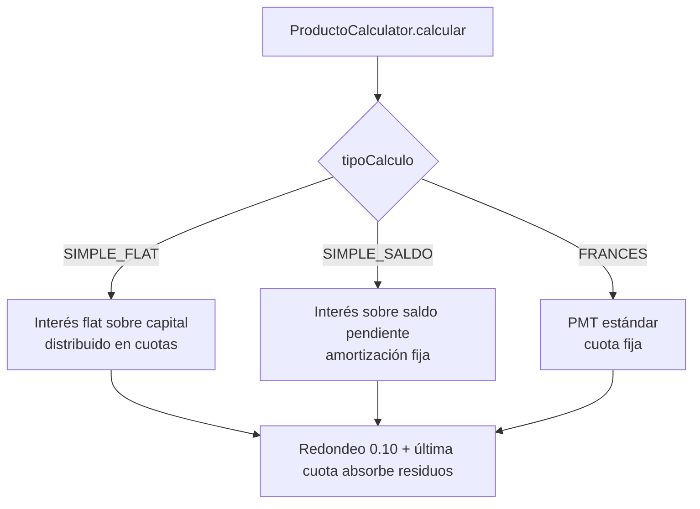

# RN-CRON · Cálculo de Cuotas y Cronograma

> Cómo se arma el cronograma de un préstamo según el producto. La exactitud aquí define cuánto
> paga el cliente y cuánto gana la financiera, así que el redondeo y los residuos importan.
>
> Fuente en código: **`utils/PrestamoCalculator.java`** (cronograma **persistido** al aprobar) y
> **`utils/ProductoCalculator.java`** (**simulación** previa) — duplican la misma lógica;
> `model/ProductoCredito.java`, `utils/MoneyUtils`, `utils/DiasHabilesUtil`.
> ⚠️ Esta duplicación está registrada en HALL-09. Las fórmulas de abajo aplican a ambos.
> Invariante: 💰 D3 (exactitud) — Σamortización = capital, Σcuotas = total a pagar.

---

## 1. Propósito

Generar el cronograma de pagos (amortización + interés por cuota) a partir del monto, plazo,
tasa y **tipo de cálculo** del producto, respetando período de gracia, redondeo a 0.10 y fechas
en días hábiles.

---

## 2. Diagrama — Dispatcher por tipo de cálculo

---

## 3. Reglas — Fórmulas por tipo

| ID | Tipo | Regla | Fuente |
|---|---|---|---|
| **RN-CRON-01** | `SIMPLE_FLAT` | `interesTotal = capital × tasaMensual × mesesEquiv`; `mesesEquiv = cuotasNormales / cuotasPorMes`. Interés y amortización fijos por cuota (FLOOR, a favor de la empresa) | `calcularSimpleFlat` |
| **RN-CRON-02** | `SIMPLE_SALDO` | `interés = saldoPendiente × tasa` (decrece cada cuota); `amortización = capital / cuotasNormales` (fija) | `calcularSimpleSaldo` |
| **RN-CRON-03** | `FRANCES` | `tem = (1+TEA)^(1/12) − 1`; cuota fija = PMT estándar; `interés = saldo × tem`; `amort = cuotaFija − interés` | `calcularFrances` |
| **RN-CRON-04** | FLAT | `cuotasPorMes`: DIARIO=26 (hábiles), SEMANAL=4, QUINCENAL=2, MENSUAL=1 | `cuotasPorMesFlat` |

---

## 4. Reglas — Redondeo, residuos y exactitud (💰 D3)

| ID | Regla | Fuente |
|---|---|---|
| **RN-CRON-05** | La **cuota total** se redondea al **múltiplo de 0.10 superior** (`roundUpTo10`) | `MoneyUtils.roundUpTo10` |
| **RN-CRON-06** | El **delta del redondeo se suma al interés**; amortización y saldo quedan **exactos** | todos los `calcular*` |
| **RN-CRON-07** | La **última cuota absorbe los residuos** de amortización e interés → `Σamortización = capital` | `esUltima` en cada método |
| **RN-CRON-08** | Redondeos intermedios usan FLOOR "a favor de la empresa" (FLAT) | `calcularSimpleFlat` |
| **RN-CRON-09** | Política global de escala/modo desde `MoneyUtils` (`decimales()`, `modo()`) | `MoneyUtils` |

> Consecuencia (invariante a probar): la suma de amortizaciones del cronograma = capital exacto;
> la suma de cuotas = total a pagar. El redondeo nunca "pierde" capital.

---

## 5. Reglas — Período de gracia

| ID | `tipoGracia` | Comportamiento en las primeras `periodoGracia` cuotas | Fuente |
|---|---|---|---|
| **RN-CRON-10** | `NINGUNA` | cálculo normal (sin gracia) | dispatcher |
| **RN-CRON-11** | `PARCIAL` | solo se cobra **interés** (sin amortización); el saldo no baja | bloque `k <= gracia` |
| **RN-CRON-12** | `TOTAL` | cuota sin pago alguno (amort=0, interés=0) | bloque `k <= gracia` |
| **RN-CRON-13** | — | las `cuotasNormales = n − gracia` reparten el capital completo | `Math.max(n − gracia, 1)` |

---

## 6. Reglas — Fechas de vencimiento (días hábiles)

| ID | Regla | Fuente |
|---|---|---|
| **RN-CRON-14** | Frecuencia: DIARIO +1 día, SEMANAL +7, QUINCENAL +15, MENSUAL +1 mes | `calcularFechaVencimiento` |
| **RN-CRON-15** | Cada vencimiento se ajusta al **siguiente día hábil** (evita sáb/dom/feriados) | `DiasHabilesUtil` |
| **RN-CRON-16** | En DIARIO, cada cuota parte de la fecha ajustada anterior para **evitar colisiones** | `fechaCuotaAjustada` |

---

## 7. ⚠️ Hallazgo detectado

### HALL-09 — Calculadora de cuotas legacy huérfana  ✅ RESUELTO (eliminada)
- **Severidad:** 🟧 Media · **Estado:** ✅ Resuelto (2026-06-12)
- Existía `service/CalculoCuotasServiceImpl` con **otro** enum (`utils.TipoCalculo` =
  `AMORTIZADO/FRANCES/LINEAL`), sin gracia ni redondeo a 0.10. Se verificó que estaba **huérfano**
  y se **eliminó** el cluster (`CalculoCuotasService(+Impl)`, `CuotaDTO`, `PrestamoRequestDTO`,
  `utils/TipoCalculo`). Compila y los 18 tests siguen verdes.
- **Pendiente menor (opcional):** `PrestamoCalculator` y `ProductoCalculator` aún duplican la
  lógica FLAT/SALDO/FRANCES → candidatos a unificar en un solo motor.

---

## 8. Casos borde / negativos

| Caso | Resultado esperado |
|---|---|
| `tem = 0` (tasa 0) en FRANCES | cuota = capital / cuotasNormales |
| gracia ≥ plazo | `cuotasNormales = 1` (toma al menos 1) |
| Vencimiento en domingo/feriado | se mueve al siguiente día hábil |
| Suma de cuotas vs total | debe cuadrar exacto (RN-CRON-07) |

---

## 9. Trazabilidad (regla → prueba)

| Regla | Prueba | Estado |
|---|---|---|
| RN-CRON-02 (SIMPLE_SALDO, interés decreciente) | `CronogramaCalculoTest.simpleSaldo_conservaCapital…` | ✅ |
| RN-CRON-05..07 (redondeo 0.10 + Σamort=capital, D3) | `CronogramaCalculoTest` (los 5 casos, `assertConservaCapital`) | ✅ |
| RN-CRON-01/03 (FLAT/FRANCES conservan capital) | `CronogramaCalculoTest.simpleFlat…` / `frances…` | ✅ |
| RN-CRON-11/12 (gracia PARCIAL/TOTAL) | `CronogramaCalculoTest.graciaParcial…` / `graciaTotal…` | ✅ |
| RN-CRON-15 (día hábil) | _pendiente_ | ❌ |

> Objetivo de la **Fase 3 — Cálculo** del [plan de pruebas](../desarrollo/plan-de-pruebas.md).

---

## Changelog
- **2026-06-12** — Documento nuevo desde el motor real `ProductoCalculator`: fórmulas FLAT/SALDO/
  FRANCES, redondeo a 0.10 con delta al interés y última cuota absorbiendo residuos, gracia
  PARCIAL/TOTAL, fechas en días hábiles. Confirma **V-04** (redondeo correcto, Σamort=capital).
  Detecta **HALL-09**: calculadora duplicada/legacy `CalculoCuotasServiceImpl` con enum
  inconsistente.
