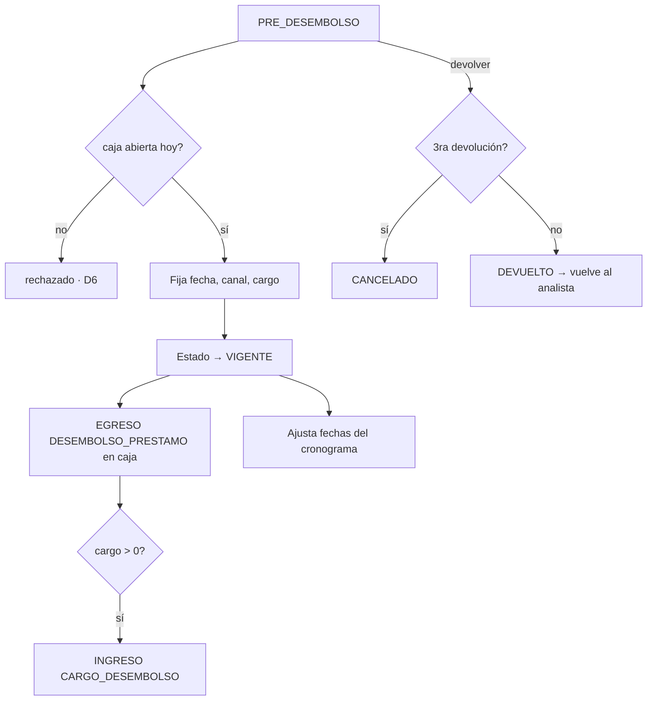

# RN-DES · Desembolso

> El cajero entrega el préstamo al cliente. Es el momento en que el crédito pasa a `VIGENTE`,
> sale el dinero de caja y se fija el cargo de desembolso. Conecta directamente con
> [RN-CAJA](./caja.md) y [RN-MOV](./movimientos-caja.md).
>
> Fuente en código: `service/PrestamoServiceImpl.confirmarDesembolso/devolver`,
> `service/ValidadorCajaService`, `service/ParametroSistemaService`.

---

## 1. Propósito

Confirmar la entrega del préstamo verificando caja y condiciones, registrar el movimiento de
salida, aplicar el cargo de desembolso y poner el préstamo en marcha (`VIGENTE`).

---

## 2. Diagrama — Desembolso

---

## 3. Reglas — Confirmar desembolso

| ID | Regla | Fuente |
|---|---|---|
| **RN-DES-01** 💰 | Exige **caja abierta** del día del cajero (D6) | `validadorCaja.exigirCajaAbiertaHoy` |
| **RN-DES-02** | Solo desde `PRE_DESEMBOLSO` (o `PENDIENTE_DESEMBOLSO`) | `confirmarDesembolso:290` |
| **RN-DES-03** | `fechaDesembolso` = la enviada, o **hoy** por defecto | `:294` |
| **RN-DES-04** | Canal `EFECTIVO` o `TRANSFERENCIA`; en transferencia se exige referencia, banco y destino | `:300-304` |
| **RN-DES-05** | El préstamo pasa a `VIGENTE` | `:314` |
| **RN-DES-06** 💰 | **Cargo de desembolso**: base = parámetro `CARGO_DESEMBOLSO`; el cajero puede **ajustarlo** (override) en el modal. Se persiste como snapshot | `:324-334` |
| **RN-DES-07** | Validación del cargo: **no negativo** y **≤ monto a desembolsar** | `:327-333` |
| **RN-DES-08** | `cargoModoCobro`: `DESCONTADO` (default) o `EFECTIVO`; si cargo=0 → null | `:339-346` |
| **RN-DES-09** | El ajuste del cargo **no cambia el monto del préstamo**, solo cómo se cobra | comentario `:321-323` |
| **RN-DES-10** | `fechaPrimerVencimiento` = la enviada, o `fechaDesembolso + intervalo` | `:308-312` |
| **RN-DES-11** | Registra métricas de originación: cliente **recurrente**, días de ciclo (evaluación→desembolso) | `:348-356` |
| **RN-DES-12** 💰 | Genera los **movimientos de caja**: EGRESO `DESEMBOLSO_PRESTAMO` (+ INGRESO `CARGO_DESEMBOLSO` si aplica) — ver [RN-MOV-03..05](./movimientos-caja.md) ⚠️ HALL-06/07 | `:455-495` |
| **RN-DES-13** | Ajusta las fechas de vencimiento del cronograma a la `fechaPrimerVencimiento` real | `:363` |

> ⚠️ El cargo editable se conecta con **HALL-06** (posible doble conteo en modo DESCONTADO) y
> **HALL-07** (registro del movimiento sin transaccionalidad). Ver [RN-MOV](./movimientos-caja.md).

---

## 4. Reglas — Devolución desde caja

| ID | Regla | Fuente |
|---|---|---|
| **RN-DES-14** | Solo se devuelve un préstamo en `PRE_DESEMBOLSO` | `devolver:512` |
| **RN-DES-15** | Cada devolución incrementa `contadorDevoluciones`; **a la 3ra → `CANCELADO`**, antes → `DEVUELTO` | `:515-522` |
| **RN-DES-16** | La devolución propaga estado `DEVUELTO` a la **evaluación** y la **aprobación**, con motivo | `:536-549` |
| **RN-DES-17** | El analista corrige y **reenvía** → vuelve a `PRE_DESEMBOLSO` | `reenviar()` |

---

## 5. Casos borde / negativos

| Caso | Resultado |
|---|---|
| Desembolsar sin caja abierta | rechazado (RN-DES-01, D6) |
| Desembolsar un préstamo no PRE_DESEMBOLSO | `IllegalStateException` (RN-DES-02) |
| Cargo negativo | `IllegalArgumentException` (RN-DES-07) |
| Cargo mayor al monto | `IllegalArgumentException` (RN-DES-07) |
| 3ra devolución | `CANCELADO` automático (RN-DES-15) |

---

## 6. Trazabilidad (regla → prueba)

| Regla | Prueba | Estado |
|---|---|---|
| RN-DES-01 (caja abierta, D6) | `FlujoNegativoTest.desembolsar_sinCajaAbierta…` | ✅ |
| RN-DES-02/05 (PRE_DESEMBOLSO → VIGENTE) | `FlujoPrestamoIntegrationTest` | ✅ |
| RN-DES-06/07 (cargo: override y validaciones) | _pendiente_ | ❌ |
| RN-DES-12 + HALL-06/07 (movimientos exactos) | _pendiente (clave 🔴)_ | ❌ |
| RN-DES-15 (3ra devolución → CANCELADO) | _pendiente_ | ❌ |

---

## Changelog
- **2026-06-12** — Documento nuevo desde el código: confirmación de desembolso (caja, canal,
  cargo editable con sus validaciones, paso a VIGENTE, métricas), generación de movimientos y
  ajuste del cronograma, y la devolución con corte a la 3ra (`CANCELADO`). Enlaza HALL-06/07.
