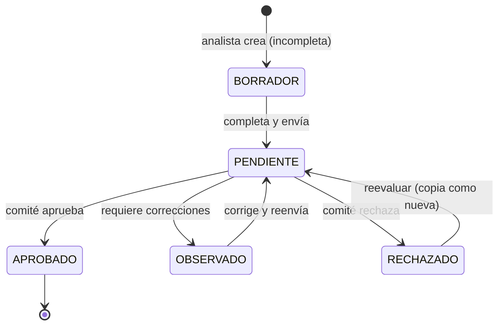

# RN-EVAL · Evaluación de Crédito

> Primer paso del flujo: el analista evalúa al cliente y calcula su **capacidad de pago**. El
> sistema computa indicadores financieros como apoyo, pero la **decisión es del analista/comité**
> (no hay auto-rechazo).
>
> Fuente en código: `model/EvaluacionCredito.java`, `service/EvaluacionCreditoServiceImpl.java`,
> **`utils/EvaluacionCreditoCalculator.java`**.

---

## 1. Propósito

Registrar la solicitud y los datos del cliente, calcular **cuota estimada**, **capacidad de pago
disponible** y **ratio de endeudamiento**, y dejar la evaluación lista para el comité.

---

## 2. Diagrama — Estados de la evaluación

> Estados reales (`estadoEvaluacion`): `BORRADOR`, `PENDIENTE`, `APROBADO`, `OBSERVADO`, `RECHAZADO`.

---

## 3. Reglas — Proceso

| ID | Regla | Fuente |
|---|---|---|
| **RN-EVAL-01** | El analista crea la evaluación; puede guardarse como `BORRADOR` (incompleta) | `EvaluacionCreditoServiceImpl:117` |
| **RN-EVAL-02** | Al registrar/actualizar se recalculan los indicadores automáticamente | `calculator.calcular()` |
| **RN-EVAL-03** | Una evaluación completa pasa a `PENDIENTE` (lista para comité) | `:168` |
| **RN-EVAL-04** | El sistema **no auto-decide**: los indicadores son de apoyo; el estado lo fija el analista/comité | `EvaluacionCreditoCalculator` (sin umbrales) |
| **RN-EVAL-05** | Solo una evaluación `RECHAZADO` puede **reevaluarse** → se copia como nueva en `PENDIENTE` | `:263-299` |
| **RN-EVAL-06** | Cada cambio guarda un **snapshot histórico** (estado anterior/nuevo) | `EvaluacionHistorial` |

---

## 4. Reglas — Indicadores financieros (💰 análisis de capacidad)

> Todo se evalúa en valores **mensuales**. La cuota del período se convierte con `factorMensual`.

| ID | Indicador | Fórmula | Fuente |
|---|---|---|---|
| **RN-EVAL-07** | **Cuota estimada** | según `tipoCalculo` del producto (ver abajo); redondeada al 0.10 superior | `calcularCuota` |
| **RN-EVAL-08** | **Capacidad de pago disponible** | `ingresos − gastos − cuotaMensual` | `calcularCapacidadPago` |
| **RN-EVAL-09** | **Ratio de endeudamiento** | `(gastos + cuotaMensual) / ingresos × 100` | `calcularRatioEndeudamiento` |
| **RN-EVAL-10** | **Factor mensual** | DIARIO=30, SEMANAL=4.33, QUINCENAL=2, MENSUAL=1 | `resolverFactorMensual` |

**Cuota estimada por tipo** (`calcularCuota`):
- `SIMPLE_FLAT` → `(Capital/N) + (Capital × tasa/N)`
- `SIMPLE_SALDO` → `(Capital/N) + (Capital × tasa)` — muestra la **cuota máxima** (1ª cuota)
- `FRANCES` → `PMT = Capital × r / (1 − (1+r)^−N)`, con `r = tasaInteresPeriodo/100`

---

## 5. ⚠️ Hallazgo detectado

### HALL-10 — La cuota estimada de la evaluación puede diferir del cronograma real
- **Severidad:** 🟧 Media · **Estado:** 🔍 En análisis
- `EvaluacionCreditoCalculator` calcula una cuota **estimada** con fórmulas simplificadas; en
  `FRANCES` usa `r = tasaInteresPeriodo/100` (tasa del período), mientras el motor real
  `ProductoCalculator` usa `tem = (1+TEA)^(1/12) − 1` (deriva la tasa mensual desde TEA). También
  el FLAT real escala con `mesesEquiv`. → la cuota mostrada al evaluar puede **no coincidir** con
  la del cronograma generado al desembolsar.
- **Impacto:** el análisis de capacidad/ratio se hace sobre una cuota que puede diferir de la
  real (sobre todo FRANCES). Aceptable si es solo "estimado", pero **conviene alinear o aclarar**.
- **Acción propuesta:** confirmar con negocio si la divergencia es tolerable; si no, unificar la
  fórmula de estimación con `ProductoCalculator`.

---

## 6. Casos borde / negativos

| Caso | Resultado esperado |
|---|---|
| Monto o cuotas nulos/≤0 | no calcula cuota (deja indicadores sin setear) |
| Ingresos = 0 | no calcula ratio (evita división por cero) |
| Reevaluar una evaluación no RECHAZADA | rechazado (RN-EVAL-05) |
| Producto sin `tipoCalculo` | asume `FRANCES` por defecto |

---

## 7. Trazabilidad (regla → prueba)

| Regla | Prueba | Estado |
|---|---|---|
| RN-EVAL-01/02/03 (registrar + indicadores) | `FlujoPrestamoIntegrationTest` (indirecto) | 🟡 |
| RN-EVAL-08/09 (capacidad y ratio exactos) | _pendiente_ | ❌ |
| RN-EVAL-05 (reevaluar solo rechazada) | _pendiente_ | ❌ |
| HALL-10 (cuota estimada vs real) | _pendiente_ | ❌ |

---

## Changelog
- **2026-06-12** — Documento nuevo desde el código: estados de la evaluación, reglas RN-EVAL-01..10
  (indicadores de capacidad/ratio, factor mensual), regla de reevaluación e historial. Detecta
  **HALL-10**: la cuota estimada (FRANCES, FLAT) puede diferir del cronograma real del
  `ProductoCalculator`.
