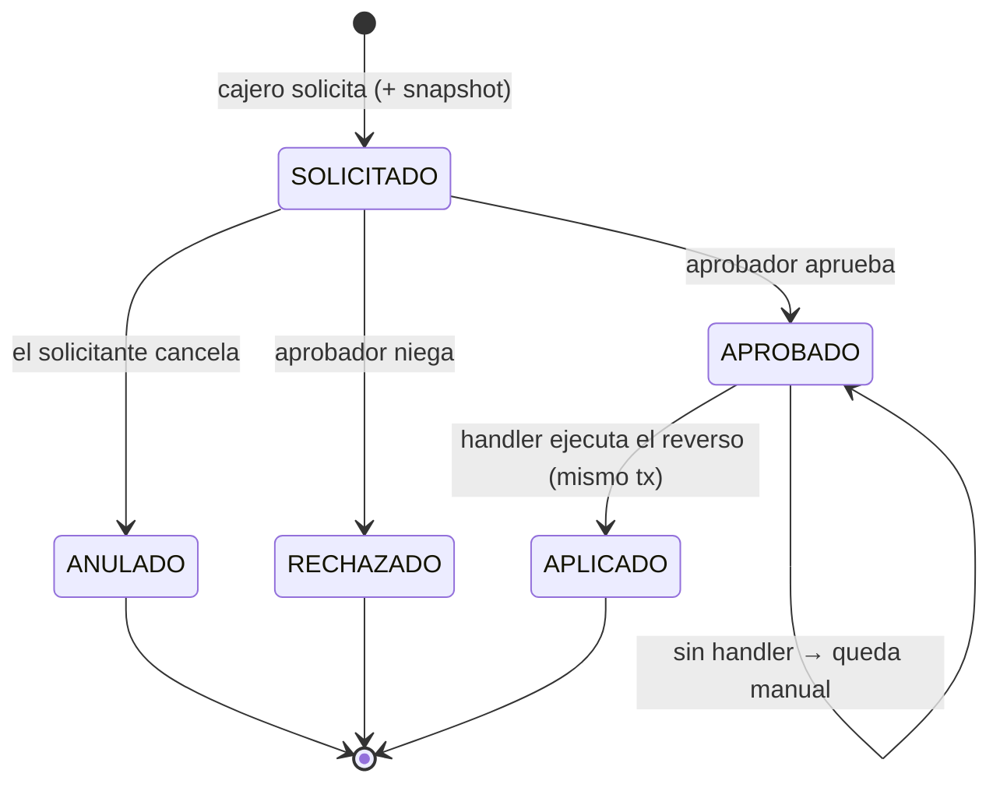

# RN-EXT · Extornos (reversa de operaciones)

> Cierra el bloque dinero. Un **extorno** revierte una operación ya registrada (un pago, un
> desembolso, un movimiento de caja) **con aprobación** y dejando rastro auditable. La invariante
> clave es 💰 **D5**: el reverso debe deshacer exactamente el efecto, sin doble aplicación.
>
> Fuente en código: `model/Extorno.java`, `service/ExtornoServiceImpl.java`,
> `service/extorno/*Handler.java`.

---

## 1. Propósito

Permitir corregir operaciones erróneas mediante un flujo controlado: el cajero **solicita**, un
aprobador **aprueba/rechaza**, y al aprobar se **aplica** el reverso contable de forma
transaccional. Cada extorno guarda un *snapshot* del documento original.

---

## 2. Diagrama — Estados del extorno

> Estados reales (`Extorno.Estado`): `SOLICITADO`, `APROBADO`, `RECHAZADO`, `APLICADO`, `ANULADO`.

---

## 3. Tipos y categorías

| Categoría | Tipos | Reversa |
|---|---|---|
| `PRESTAMO` | `PAGO_CUOTA`, `DESEMBOLSO` | handler reabre la cuota / revierte el desembolso |
| `OPERATIVO` | `INGRESO_CAJA`, `EGRESO_CAJA` | handler anula el movimiento de caja |
| `CUADRE` | `APERTURA_TURNO`, `CIERRE_TURNO`, `SOBRANTE`, `FALTANTE`, `AJUSTE_CUADRE` | sin handler automático (reverso manual) |

---

## 4. Reglas — Flujo y control

| ID | Regla | Fuente |
|---|---|---|
| **RN-EXT-01** | Flujo: `solicitar` → `aprobar`/`rechazar`; el solicitante puede `cancelar` (→ ANULADO) antes de aprobación | `ExtornoServiceImpl` |
| **RN-EXT-02** | Al solicitar se captura un **snapshot** del documento original (monto, descripción, datos) | `solicitar()` |
| **RN-EXT-03** 💰 | **No se extorna dos veces**: bloquea si ya hay un extorno `APLICADO` o uno **en trámite** sobre el documento (D7) | `solicitar()` líneas 94-102 |
| **RN-EXT-04** ⭐ | Al **aprobar**, el handler se aplica en la **misma transacción**: si falla, **re-lanza** y hace rollback (no deja estado a medias) | `aprobar()` líneas 273-287 |
| **RN-EXT-05** | Cada handler es **idempotente**: si el documento ya está extornado, no hace nada | todos los `*Handler` |
| **RN-EXT-06** | Si no hay handler para el tipo, el extorno queda `APROBADO` sin aplicar (reverso manual) | `aprobar()` línea 267 |

> ⭐ **RN-EXT-04 es el patrón correcto de transaccionalidad** — contrasta con HALL-07, donde el
> registro del movimiento de caja en pago/desembolso **no** revierte la operación si falla.

---

## 5. Reglas — Reversa por tipo (handlers)

### PAGO_CUOTA (`PagoCuotaExtornoHandler`)
| ID | Regla |
|---|---|
| **RN-EXT-07** | Restaura cada cuota: estado `VENCIDO`/`PENDIENTE` según fecha, `montoPagado=0`, `mora=0`, `fechaPago=null` |
| **RN-EXT-08** | Suma el capital revertido al `saldoCapital` del préstamo |
| **RN-EXT-09** | Si el préstamo estaba `LIQUIDADO` → vuelve a `VIGENTE`; marca el pago `extornado=true` |
| **RN-EXT-10** | **No soporta** pago parcial ni pago con excedente a siguiente cuota → lanza excepción (reverso manual) |

### DESEMBOLSO (`DesembolsoExtornoHandler`)
| ID | Regla |
|---|---|
| **RN-EXT-11** | **Exige que no haya pagos activos**: primero deben extornarse todas las cuotas pagadas |
| **RN-EXT-12** | Solo desde `VIGENTE`/`DESEMBOLSADO`; pasa el préstamo a `APROBADO`, elimina el cronograma, `saldoCapital=0`, `fechaDesembolso=null`, marca `desembolsoExtornado` |

### INGRESO_CAJA / EGRESO_CAJA (`MovimientoCajaExtornoHandler`)
| ID | Regla |
|---|---|
| **RN-EXT-13** 💰 | Marca el movimiento `anulado=true` + `extornado=true`; como el saldo suma solo `anulado=false`, **neutraliza el efecto en caja** (D5) |

---

## 6. ⚠️ Hallazgo de dinero detectado

### HALL-08 — Extornar pago/desembolso no neutralizaba el movimiento de caja  ✅ CORREGIDO
- **Severidad:** 🔴 Alta (dinero) · **Estado:** ✅ Corregido (2026-06-12)
- Antes, los handlers de `PAGO_CUOTA` y `DESEMBOLSO` revertían el **lado préstamo** pero **no
  marcaban** el `movimiento_caja` automático (`COBRO_CUOTA` / `DESEMBOLSO_PRESTAMO`) como
  `anulado`/`extornado` → seguía contando en el cuadre.
- **Fix:** ambos handlers ahora **neutralizan** los movimientos de caja asociados (buscados por
  `referencia` = N° contrato / N° recibo): los marcan `anulado=true` + `extornado=true`, igual que
  `MovimientoCajaExtornoHandler`. Validado por `DineroConservacionTest.extornoDesembolso_neutralizaCaja`.

---

## 7. Casos borde / negativos

| Caso | Resultado |
|---|---|
| Extornar un documento ya extornado | rechazado (RN-EXT-03) |
| Extornar con una solicitud en trámite | rechazado (RN-EXT-03) |
| Extornar desembolso con pagos activos | rechazado, exige extornar pagos primero (RN-EXT-11) |
| Extornar pago parcial / con excedente | excepción → reverso manual (RN-EXT-10) |
| Falla el handler al aplicar | rollback completo, extorno no queda APLICADO (RN-EXT-04) |

---

## 8. Trazabilidad (regla → prueba)

| Regla | Prueba | Estado |
|---|---|---|
| RN-EXT-03 (no doble extorno, D7) | `ExtornoPagoTest.noSePuedeExtornarDosVeces` | ✅ |
| RN-EXT-04 (rollback si falla, tx) | _pendiente_ | ❌ |
| RN-EXT-07..09 (reversa de pago, D5) | `ExtornoPagoTest.extornoPago_revierteCuotaYNeutralizaCaja` | ✅ |
| RN-EXT-11/12 (reversa de desembolso, D5) | `DineroConservacionTest.extornoDesembolso_neutralizaCaja` | ✅ |
| RN-EXT-13 + HALL-08 (neutralización en caja) | `DineroConservacionTest.extornoDesembolso_neutralizaCaja` | ✅ |

> 🔴 Junto con Caja y Movimientos, los extornos son el núcleo de la **Fase 1 — DINERO**.

---

## Changelog
- **2026-06-12** — Documento nuevo, extraído del código: estados del extorno, tipos/categorías,
  reglas RN-EXT-01..13 con fuente. Confirmado el **patrón transaccional correcto** (RN-EXT-04,
  contrasta HALL-07) y la **idempotencia** (D7). Detectado **HALL-08**: los extornos de
  pago/desembolso no neutralizan el movimiento de caja asociado. Resuelve la sospecha V-02.
