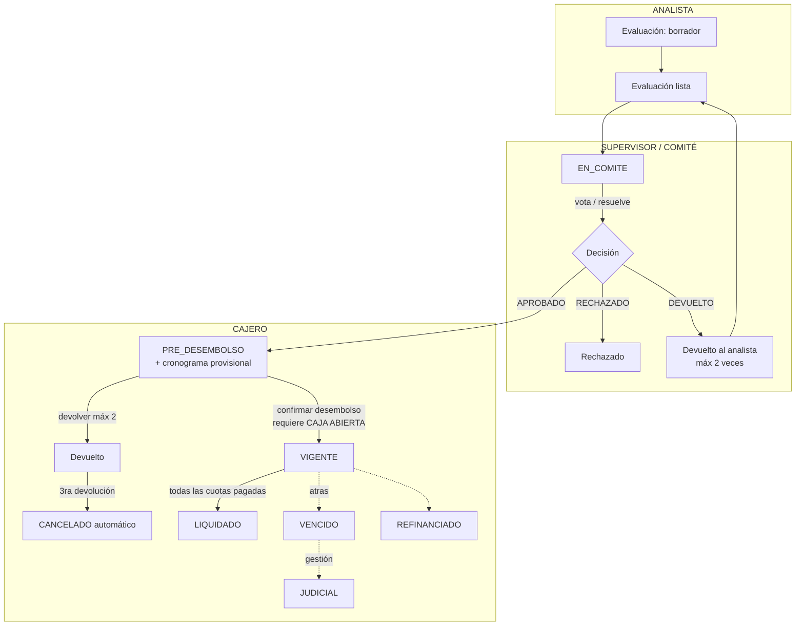
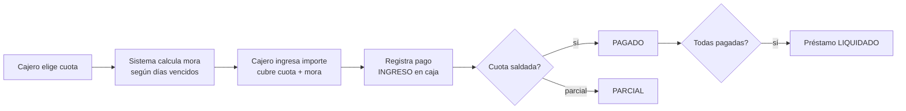

# RN-FLU · Flujo del Préstamo

> **Segundo nodo del árbol.** Sobre los actores (ver [`roles-permisos.md`](./roles-permisos.md))
> se monta el proceso central: cómo un crédito nace, se aprueba, se desembolsa y se cobra.
>
> Fuente en código: `model/Prestamo.java`, `controller/PrestamoController.java`,
> `service/EvaluacionCreditoService`, `service/AprobacionCreditoService`,
> `service/PrestamoService`, `service/PagoCajeroServiceImpl`, `service/MoraCalculator`.

---

## 1. Propósito

Llevar un crédito desde la evaluación del analista hasta su liquidación, pasando por el comité,
el desembolso en caja y la cobranza de cuotas — con control de estados y de quién puede actuar
en cada paso.

---

## 2. Diagrama — Estados y actores

> Estados reales del préstamo (`Prestamo.java`): `PRE_DESEMBOLSO`, `VIGENTE`, `LIQUIDADO`,
> `CANCELADO`, `DEVUELTO`, `VENCIDO`, `JUDICIAL`, `REFINANCIADO`.

---

## 3. Reglas por etapa

### 3.1 Evaluación → Comité
| ID | Regla | Fuente |
|---|---|---|
| **RN-FLU-01** | El analista crea la evaluación con datos del cliente y condiciones | `EvaluacionCreditoService.registrar` |
| **RN-FLU-02** | Enviar a comité: `ADMIN`, `GERENTE_AGENCIA`, `SUPERVISOR`, `ANALISTA` | `@PreAuthorize` |
| **RN-FLU-03** | El comité decide (`COMITE`, `ANALISTA`, `ADMIN`) | `AprobacionCreditoController` |
| **RN-FLU-04** | Para **APROBAR** se exige producto, monto, tasa y plazo **finales** | `aprobacionService.actualizar` (lanza `IllegalArgumentException`) |

### 3.2 Aprobación → Pre-desembolso
| ID | Regla | Fuente |
|---|---|---|
| **RN-FLU-05** | Al aprobar se crea el préstamo en `PRE_DESEMBOLSO` con **cronograma provisional** | `AprobacionCreditoService` |
| **RN-FLU-06** | El cronograma se calcula según el producto (FLAT / SALDO / FRANCES) | `CalculoCuotasService` (ver RN-CRON) |

### 3.3 Desembolso
| ID | Regla | Fuente |
|---|---|---|
| **RN-FLU-07** | Solo `ADMINISTRADOR` y `CAJERO_COBRANZA` confirman desembolso | `@PreAuthorize` PrestamoController |
| **RN-FLU-08** | **No se puede desembolsar sin caja abierta** | `confirmarDesembolso` → excepción 💰 D6 |
| **RN-FLU-09** | Al desembolsar: préstamo → `VIGENTE`; fechas del cronograma se ajustan a la fecha real | `PrestamoService` |
| **RN-FLU-10** | El cajero **no modifica condiciones**, solo verifica y entrega | regla de proceso |
| **RN-FLU-11** | Máx **2 devoluciones** en desembolso; a la 3ra → `CANCELADO` automático | `contadorDevoluciones` (`Prestamo.java`) |

### 3.4 Post-desembolso
| ID | Regla | Fuente |
|---|---|---|
| **RN-FLU-12** | Evaluación y aprobación quedan en **solo lectura** | regla de proceso |
| **RN-FLU-13** | Solo cobranza interactúa con el préstamo (pagos de cuotas) | `PagoCajeroService` |
| **RN-FLU-14** | Cuando **todas** las cuotas quedan pagadas → debería ser `LIQUIDADO` ⚠️ pero el código deja `CANCELADO` (ver **HALL-12**) | `PagoCajeroServiceImpl:335` |

---

## 4. Flujo de pago de cuotas

| ID | Regla | Fuente |
|---|---|---|
| **RN-FLU-15** | El pago se registra como **INGRESO** en la caja del cajero | `PagoCajeroServiceImpl` (💰 ver RN-MOV) |
| **RN-FLU-16** | El importe entregado debe cubrir cuota + mora; si es menor → `PARCIAL` | `PagoCajeroServiceImpl` |
| **RN-FLU-17** | El pago genera **un solo** INGRESO por el total; concepto `COBRO_CUOTA` (o `COBRO_MORA` si es **solo** mora) — ver [RN-MOV-02](./movimientos-caja.md) | `PagoCajeroServiceImpl` |

---

## 5. ⚠️ Hallazgo crítico — Mora divergente (cobranza vs caja)

> **Tema de dinero. Pendiente de decisión de negocio.** El `MoraCalculator` mantiene
> **dos reglas distintas** a propósito, y su Javadoc lo declara *"un bug preexistente que queda
> pendiente de reconciliar"*:

| Contexto | Método | PORCENTAJE cuenta | Gracia | Escala |
|---|---|---|---|---|
| Listados de **cobranza** | `paraCobranza` | días **HÁBILES** | respeta | redondeo snapshot |
| **Cobro real en caja** | `paraPago` | días **CALENDARIO** | sin gracia | fija 2 |

**Consecuencia:** una misma cuota vencida puede mostrar **una mora en la pantalla de cobranza y
otra al cobrar en caja**. Para `PORCENTAJE`, caja suele cobrar **más** (calendario ≥ hábiles).

| ID | Regla | Estado |
|---|---|---|
| **RN-MORA-01** | `PORCENTAJE`: mora = amortización × (tasaMora/3000) × días | ✅ implementado (días difieren por contexto) |
| **RN-MORA-02** | `FIJO`: monto fijo tras período de gracia | ✅ |
| **RN-MORA-03** | `FIJO_DIARIO_HABILES`: monto fijo × días hábiles (excluye sáb/dom/feriados) | ✅ |
| **RN-MORA-04** | Préstamos `DIARIO` con flag `moraDesdeFechaFin`: mora desde la **fecha fin** del préstamo | ✅ |
| **RN-MORA-05** | **Unificar hábiles vs calendario** entre cobranza y caja | 🔴 **DECISIÓN PENDIENTE** |

> 👉 Acción recomendada: definir con negocio cuál es la regla correcta (hábiles o calendario),
> unificar `MoraCalculator`, y blindar con una prueba que compare `paraCobranza` vs `paraPago`
> sobre la misma cuota. Hasta entonces, **documentado como riesgo conocido**.

---

## 6. Casos borde / negativos

| Caso | Resultado |
|---|---|
| Aprobar sin producto/monto/tasa/plazo final | `IllegalArgumentException` (RN-FLU-04) |
| Desembolsar sin caja abierta | excepción (RN-FLU-08) |
| 3ra devolución de un préstamo | `CANCELADO` automático (RN-FLU-11) |
| Pago menor a la cuota | estado `PARCIAL` (RN-FLU-16) |
| Pago de cuota vencida | cobra mora `COBRO_MORA` (RN-FLU-17) |

---

## 7. Trazabilidad (regla → prueba)

| Regla | Prueba | Estado |
|---|---|---|
| RN-FLU-01..09, 14 (flujo feliz) | `FlujoPrestamoIntegrationTest` | ✅ |
| RN-FLU-04 (aprobar sin producto) | `FlujoNegativoTest.aprobar_sinProductoFinal…` | ✅ |
| RN-FLU-08 (desembolso sin caja) | `FlujoNegativoTest.desembolsar_sinCajaAbierta…` | ✅ |
| RN-FLU-07 (solo ADMIN/CAJERO) | `RbacIntegrationTest` | ✅ |
| RN-FLU-16 (pago parcial) | `PagosIntegrationTest.pagoParcial…` | ✅ |
| RN-FLU-17 / RN-MORA-01 (cobra mora) | `PagosIntegrationTest.pagoCuotaVencida_cobraMora` | ✅ |
| RN-FLU-11 (3ra devolución → CANCELADO) | _pendiente_ | ❌ |
| RN-MORA-05 (cobranza vs caja iguales) | _pendiente (clave)_ | 🔴 |

---

## Changelog
- **2026-06-12** — Reescrito desde el código: diagramas Mermaid de estados y de pago, reglas
  RN-FLU-01..17 con fuente, y **documentado el hallazgo crítico de mora divergente** (cobranza
  cuenta días hábiles, caja cuenta días calendario — decisión de negocio pendiente). Corrige la
  versión previa que afirmaba simplemente "mora por días hábiles".
