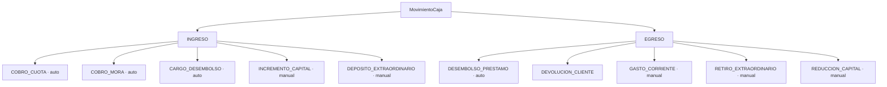

# RN-MOV · Movimientos de Caja (ingresos y egresos)

> Cada peso que entra o sale de la caja es un **movimiento** con tipo, concepto, monto y canal.
> El saldo teórico (ver [RN-CAJA](./caja.md)) se calcula sumando estos movimientos, así que su
> exactitud es la base de todo el cuadre.
>
> Fuente en código: `model/MovimientoCaja.java`, `service/CajaServiceImpl.registrarAutomatico`,
> `service/PrestamoServiceImpl` (desembolso), `service/PagoCajeroServiceImpl` (cobro).
> Invariantes: 💰 D2 (trazabilidad), D3 (exactitud), D1 (conservación).

---

## 1. Propósito

Registrar de forma trazable toda entrada/salida de dinero de la caja, distinguiendo **canal**
(EFECTIVO físico vs BANCO) y **concepto**, para que el cuadre y la auditoría sean exactos.

---

## 2. Catálogo de conceptos (`ConceptoMovimiento`)

| Tipo | Concepto | Origen | Cuándo |
|---|---|---|---|
| INGRESO | `COBRO_CUOTA` | automático | pago de cuota (capital/interés) |
| INGRESO | `COBRO_MORA` | automático | pago **solo** de mora |
| INGRESO | `CARGO_DESEMBOLSO` | automático | cargo cobrado al desembolsar |
| INGRESO | `INCREMENTO_CAPITAL` | manual | aporte de capital (con billetaje si efectivo) |
| INGRESO | `DEPOSITO_EXTRAORDINARIO` | manual | depósito/ingreso extraordinario |
| EGRESO | `DESEMBOLSO_PRESTAMO` | automático | entrega del préstamo |
| EGRESO | `DEVOLUCION_CLIENTE` | manual/op | devolución a un cliente |
| EGRESO | `GASTO_CORRIENTE` | manual | gasto operativo |
| EGRESO | `RETIRO_EXTRAORDINARIO` | manual | retiro extraordinario |
| EGRESO | `REDUCCION_CAPITAL` | manual | reducción de capital |

> **Aliases legacy** (no eliminar, datos históricos): `APORTE_CAPITAL`→`INCREMENTO_CAPITAL`,
> `OTRO_INGRESO`→`DEPOSITO_EXTRAORDINARIO`, `GASTO_OPERATIVO`→`GASTO_CORRIENTE`,
> `OTRO_EGRESO`→`RETIRO_EXTRAORDINARIO`.

---

## 3. Reglas

| ID | Regla | Fuente |
|---|---|---|
| **RN-MOV-01** | Todo movimiento lleva `tipo` + `concepto` + `monto` + `canal` (EFECTIVO/BANCO) (💰 D2) | `MovimientoCaja` |
| **RN-MOV-02** | **Pago de cuota** → **un** INGRESO por el **total pagado** (capital+interés+mora); concepto `COBRO_CUOTA`, o `COBRO_MORA` si el pago es **solo** mora | `PagoCajeroServiceImpl:423-445` |
| **RN-MOV-03** | **Desembolso** → EGRESO `DESEMBOLSO_PRESTAMO`; canal `BANCO` si transferencia, si no `EFECTIVO` | `PrestamoServiceImpl:455` |
| **RN-MOV-04** | **Cargo de desembolso** (si > 0) → INGRESO `CARGO_DESEMBOLSO` por el cargo | `PrestamoServiceImpl:487` |
| **RN-MOV-05** | El **monto del EGRESO** depende del modo de cobro del cargo:  • `EFECTIVO` (aparte) → EGRESO = **bruto**  • `DESCONTADO` → EGRESO = **bruto − cargo** (neto) | `PrestamoServiceImpl:441-443` |
| **RN-MOV-06** | Canal `BANCO` no afecta el efectivo; se cuadra en su propia columna (ver RN-CAJA-07) | `cuadre()` |
| **RN-MOV-07** | `billetaje` (desglose) solo en INGRESO + EFECTIVO + `INCREMENTO_CAPITAL` | `MovimientoCaja` |
| **RN-MOV-08** | Anulación **lógica** (`anulado`, `anuladoPor`, `anuladoAt`); el extorno marca `extornado`+`extornoId` | `MovimientoCaja`, `CajaServiceImpl.eliminar` |

---

## 4. ⚠️ Hallazgos de dinero detectados (a confirmar con prueba)

> Documentados como riesgo; ver detalle en [`../HALLAZGOS.md`](../HALLAZGOS.md).

### HALL-06 — Posible doble conteo del cargo en desembolso DESCONTADO
En modo `DESCONTADO`, el EGRESO se reduce a `neto` **y además** se registra el INGRESO
`CARGO_DESEMBOLSO`. Efecto en caja = `−neto + cargo`, pero físicamente solo salió `neto` →
el saldo teórico podría quedar **inflado en `cargo`** (faltante artificial al cerrar).
En modo `EFECTIVO` (EGRESO=bruto + INGRESO=cargo) **sí** conserva. → **Confirmar con un test de
conservación (D1).**

### HALL-07 — El registro del movimiento no revierte la operación si falla
Tanto en pago como en desembolso, `registrarAutomatico(...)` está dentro de un `try/catch` que
solo **loguea un warning**. Si falla, el **pago/desembolso ya quedó persistido** pero **sin
movimiento de caja** → dinero recibido/entregado que **no aparece en el cuadre** (rompe D1/D2).
→ **Evaluar transaccionalidad** (que el fallo del movimiento revierta la operación).

---

## 5. Casos borde / negativos

| Caso | Resultado esperado |
|---|---|
| Pago solo de mora | INGRESO `COBRO_MORA` (no `COBRO_CUOTA`) |
| Desembolso por transferencia | EGRESO canal `BANCO` (no afecta efectivo) |
| Desembolso con cargo descontado | EGRESO neto + INGRESO cargo (⚠️ ver HALL-06) |
| Movimiento ya anulado | no se puede volver a anular (RN-CAJA-20) |

---

## 6. Trazabilidad (regla → prueba)

| Regla | Prueba | Estado |
|---|---|---|
| RN-MOV-02 (pago genera INGRESO) | `PagosIntegrationTest` (indirecto) | 🟡 |
| RN-MOV-03 (desembolso genera EGRESO) | _pendiente_ | ❌ |
| RN-MOV-05 / HALL-06 (conservación cargo) | _pendiente (clave 🔴)_ | ❌ |
| RN-MOV-08 / HALL-07 (transaccionalidad) | _pendiente (clave 🔴)_ | ❌ |
| Conceptos manuales (ingreso/egreso) | _pendiente_ | ❌ |

---

## Changelog
- **2026-06-12** — Documento nuevo, extraído del código: catálogo de conceptos, reglas
  RN-MOV-01..08, y **dos hallazgos de dinero** (HALL-06 doble conteo en descontado, HALL-07
  registro sin transaccionalidad). Corrige la idea previa de que capital y mora generaban
  movimientos separados: en realidad es **un solo INGRESO por el total** con un concepto.
