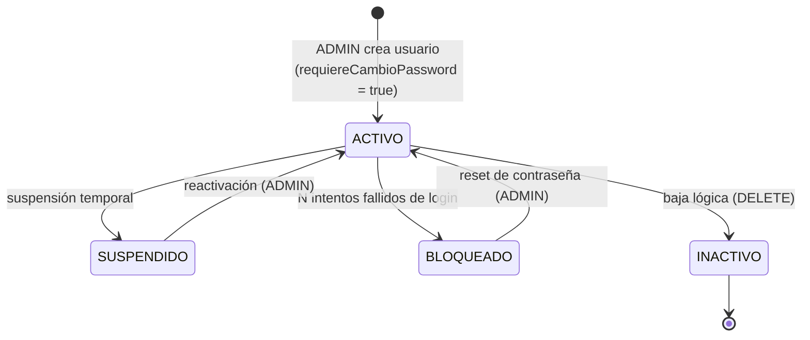
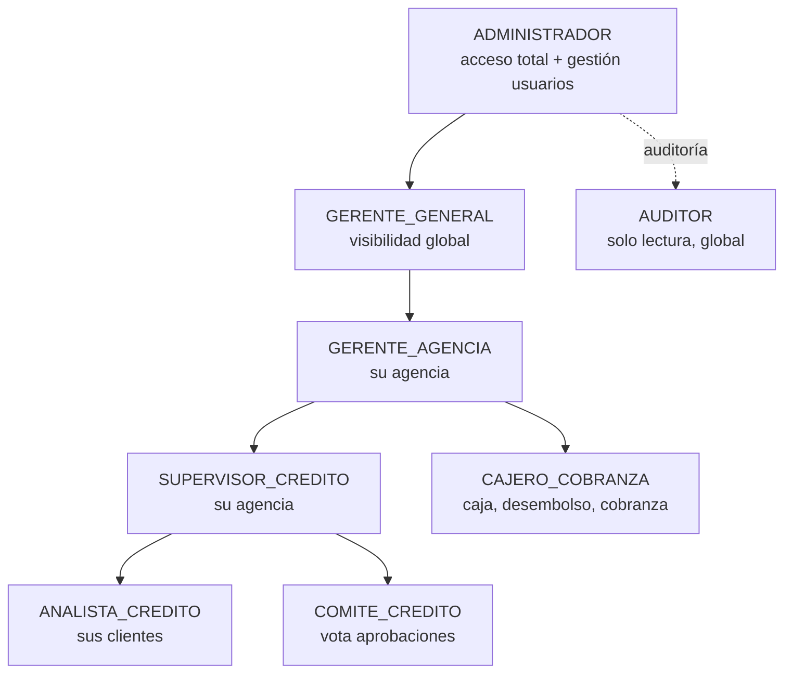
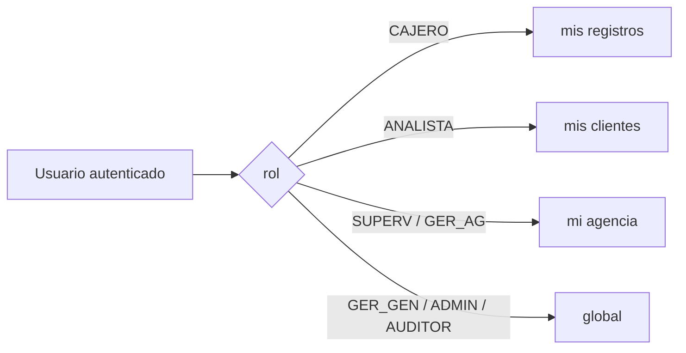

# RN-ROL · Usuarios, Roles y Permisos

> **Raíz del árbol del sistema.** Todo proceso (evaluar, aprobar, desembolsar, cobrar) lo ejecuta
> un **usuario** con un **rol**. Aquí se define cómo nace un usuario, su ciclo de vida, qué puede
> hacer cada rol y qué datos ve. El resto de las reglas de negocio se cuelgan de este tronco.
>
> Fuente en código: `model/Usuario.java`, `controller/UsuarioController.java`,
> `configuration/SecurityConfig.java`, `service/ReportesAvanzadosService.computarScope()`.

---

## 1. Propósito

Gestionar la identidad y autorización: creación de usuarios, autenticación JWT, asignación de
rol y agencia, y el control de **qué endpoint** puede tocar cada rol (`@PreAuthorize`) y **qué
datos** puede ver (scope).

---

## 2. Diagrama — Ciclo de vida del usuario

## 3. Diagrama — Jerarquía de roles (organigrama)

> ℹ️ El organigrama es **organizacional**, no una jerarquía de herencia: los permisos NO se
> heredan por nivel. Cada endpoint declara sus roles explícitamente en `@PreAuthorize`
> (ver §6). Un `GERENTE_GENERAL`, por ejemplo, puede tener menos acceso de escritura que un
> `ANALISTA` en ciertos módulos (garantías).

---

## 4. Reglas — Creación y ciclo de vida del usuario

| ID | Regla | Detalle | Fuente |
|---|---|---|---|
| **RN-ROL-01** | Solo `ADMINISTRADOR` crea/edita/elimina usuarios | `POST/PUT/DELETE /api/v1/usuarios` → `hasRole('ADMINISTRADOR')` | `UsuarioController` |
| **RN-ROL-02** | Campos únicos | `username`, `email`, `dni_cuit` con `@UniqueConstraint` | `Usuario.java` |
| **RN-ROL-03** | Todo usuario pertenece a una agencia | `agencia_id` es `nullable = false` | `Usuario.java` |
| **RN-ROL-04** | Contraseña siempre cifrada | `BCryptPasswordEncoder`; se guarda `passwordHash`, nunca texto plano | `SecurityConfig` |
| **RN-ROL-05** | Primer ingreso obliga cambio de clave | `requiereCambioPassword = true` por defecto | `Usuario.java` |
| **RN-ROL-06** | Estado inicial `ACTIVO` | enum `EstadoUsuario {ACTIVO, INACTIVO, SUSPENDIDO, BLOQUEADO}` | `Usuario.java` |
| **RN-ROL-07** | Bloqueo por intentos fallidos | `intentosFallidosLogin`; rate-limit en login (`LoginRateLimitFilter`) | `SecurityConfig` |
| **RN-ROL-08** | Baja **lógica**, no física | `DELETE` marca inactivo, no borra el registro | `UsuarioController` |
| **RN-ROL-09** | Reset de clave solo `ADMINISTRADOR` | `PATCH /{id}/reset-password` → `hasRole('ADMINISTRADOR')` | `UsuarioController` |
| **RN-ROL-10** | Cada quien cambia su propia clave / perfil | `PATCH /{id}/password`, `/perfil/me` → `isAuthenticated()` | `UsuarioController` |
| **RN-ROL-11** | `montoMaximoAprobacion` por usuario | tope de aprobación individual (BigDecimal, default 0) | `Usuario.java` |

---

## 5. Los 8 roles y qué hace cada uno

> El enum real es `Usuario.RolUsuario`. Estas responsabilidades son el "tronco" del que cuelgan
> las reglas de cada proceso.

| Rol | Responsabilidad principal | Procesos que ejecuta |
|---|---|---|
| `ADMINISTRADOR` | Acceso total + administra usuarios, bancos, parámetros | todo |
| `GERENTE_GENERAL` | Visión global de todas las agencias; aprobaciones de alto nivel | aprobación, reportes, anular cierres |
| `GERENTE_AGENCIA` | Gestión de **su** agencia | aprobación, caja, bóveda, cierres |
| `SUPERVISOR_CREDITO` | Supervisa evaluaciones y envía a comité | evaluación, aprobación, caja/bóveda |
| `ANALISTA_CREDITO` | Crea y gestiona evaluaciones de **sus** clientes | evaluación, aprobación (enviar) |
| `COMITE_CREDITO` | Vota en el comité de crédito | decisión de aprobación |
| `CAJERO_COBRANZA` | Opera caja: desembolsos, cobros, cuadre | caja, desembolso, cobranza |
| `AUDITOR` | Solo lectura transversal (global) | reportes, consulta |

---

## 6. Matriz de permisos por endpoint (REAL, de `@PreAuthorize`)

| Acción | ADMIN | GER_GEN | GER_AG | SUPERV | ANALISTA | COMITE | CAJERO | AUDITOR |
|---|---|---|---|---|---|---|---|---|
| Crear/editar/eliminar usuario | ✅ | — | — | — | — | — | — | — |
| Listar usuarios | ✅ | ✅ | — | — | — | — | — | — |
| Cambiar **mi** clave / perfil | ✅ | ✅ | ✅ | ✅ | ✅ | ✅ | ✅ | ✅ |
| Enviar evaluación a comité | ✅ | — | ✅ | ✅ | ✅ | — | — | — |
| Decidir aprobación (comité) | ✅ | — | — | — | ✅ | ✅ | — | — |
| Leer expediente de aprobación | ✅ | ✅ | ✅ | ✅ | ✅ | ✅ | — | ✅ |
| **Desembolso** | ✅ | — | — | — | ❌ | — | ✅ | ❌ |
| Abrir caja | ✅ | ✅ | — | — | — | — | ✅ | — |
| Cerrar caja (arqueo) | ✅ | ✅ | ✅ | ✅ | — | — | ✅ | — |
| **Anular cierre de caja** | ✅ | ✅ | — | — | — | — | — | — |
| Bóveda (operar) | ✅ | ✅ | ✅ | ✅ | — | — | ✅ | — |
| Garantías: registrar/editar | ✅ | — | ✅ | ✅ | ✅ | — | — | — |
| Garantías: consultar | ✅ | ✅ | ✅ | ✅ | ✅ | — | — | ✅ |
| Bancos: escritura | ✅ | — | — | — | — | — | — | — |
| Bancos: lectura | ✅ | ✅ | ✅ | ✅ | ✅ | ✅ | ✅ | ✅ |

`✅` permitido · `❌` explícitamente denegado (probado) · `—` sin acceso al endpoint
*(`@EnableMethodSecurity` activa `@PreAuthorize`; un rol sin permiso recibe **403 Forbidden**).*

---

## 7. Scope de datos — qué VE cada rol (REAL, `computarScope()`)

> ⚠️ **Corrige la deriva previa** ("cada usuario solo ve su agencia"). El scope real es:

| Rol | Alcance de datos | Implementación |
|---|---|---|
| `CAJERO_COBRANZA` | **Solo sus propios registros** (no toda la agencia) | `scope.cajeroId = userId` |
| `ANALISTA_CREDITO` | **Solo sus propios clientes** | `scope.analistaId = userId` |
| `SUPERVISOR_CREDITO` | Toda **su** agencia | `scope.agenciaId = agenciaId` |
| `GERENTE_AGENCIA` | Toda **su** agencia | `scope.agenciaId = agenciaId` |
| `GERENTE_GENERAL` | **Global** (todas las agencias; respeta filtro de UI) | sin restricción |
| `ADMINISTRADOR` | **Global** | sin restricción |
| `AUDITOR` | **Global** (solo lectura) | sin restricción |

---

## 8. Casos borde / negativos

| Caso | Resultado esperado |
|---|---|
| Rol sin permiso llama a un endpoint protegido | **403 Forbidden** |
| Petición a `/api/**` sin token JWT | **401/403** (no autenticado) |
| Crear usuario con `username`/`email`/`dni` duplicado | error de restricción única |
| Crear usuario sin agencia | rechazado (`agencia_id` NOT NULL) |
| Cajero intenta ver cartera de otro cajero | scope lo limita a lo suyo |
| Analista intenta ver clientes de otro analista | scope lo limita a lo suyo |

---

## 9. Trazabilidad (regla → prueba)

| Regla | Prueba | Estado |
|---|---|---|
| RN-ROL (desembolso ANALISTA/AUDITOR → 403) | `RbacIntegrationTest.desembolso_denegadoPara*` | ✅ |
| RN-ROL (CAJERO/ADMIN pasan el gate) | `RbacIntegrationTest.desembolso_permitido*` | ✅ |
| RN-ROL (sin token → 401/403) | `RbacIntegrationTest.desembolso_sinToken*` | ✅ |
| RN-ROL-01 (solo ADMIN crea usuario) | _pendiente_ | ❌ |
| RN-ROL-07 (bloqueo por intentos) | _pendiente_ | ❌ |
| Scope cajero/analista/agencia | _pendiente (Fase 2)_ | ❌ |

---

## Changelog
- **2026-06-12** — Reescrito desde el código: agregados ciclo de vida, organigrama (Mermaid),
  reglas de creación RN-ROL-01..11, matriz real de `@PreAuthorize`, y **corrección del scope**
  (cajero→sus registros, analista→sus clientes, auditor→global), que antes estaba inexacto.
- **2026-06-12 (validación)** — Verificado contra los `@PreAuthorize` reales. Corregida la fila
  de **Garantías**: el `ANALISTA_CREDITO` SÍ registra/edita garantías y el `GERENTE_GENERAL`
  solo consulta (no escribe). Desembolso confirmado: solo `ADMINISTRADOR` y `CAJERO_COBRANZA`.
