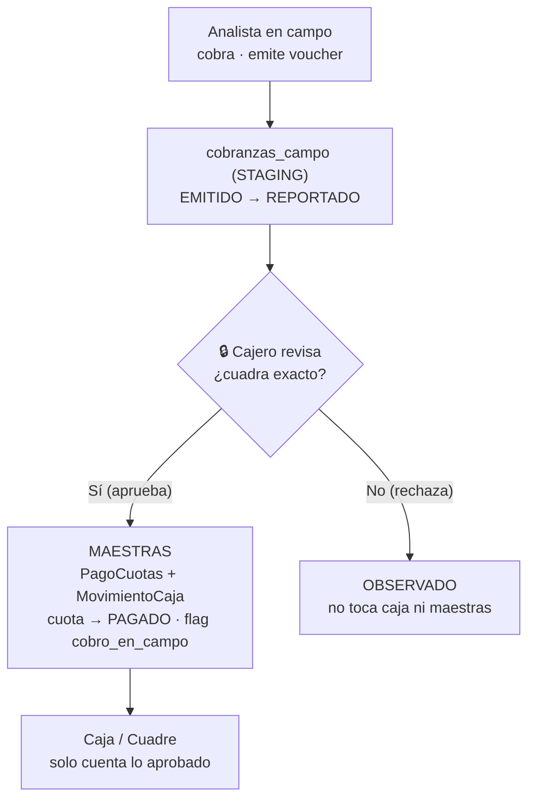

# Req1 — Cobranza de campo con aprobación del cajero

> El analista (gestor habilitado) cobra en campo y emite voucher. Al volver, reporta la
> cobranza del día al cajero; el cajero **aprueba** antes de que impacte los ingresos/egresos
> de caja. Objetivo: **no afectar el flujo ni las reglas de negocio existentes.**
>
> **Estado:** ✅ implementado y desplegado en CrediActiva prod (backend + frontend), 2026-06.

---

## 1. Idea central — staging → gate → maestra

La cobranza de campo vive en una **tabla intermedia** y **no toca caja** hasta que el cajero
aprueba; recién ahí se **promueve** a las tablas maestras existentes.

---

## 2. Decisiones de negocio (confirmadas)

| # | Decisión |
|---|---|
| **D-1** | La tabla intermedia maneja **sus propios estados**. Al aprobar, se promueve a las maestras usando el flujo existente **sin cambios**, agregando solo el flag `cobro_en_campo`. La cuota se marca `PAGADO` **al aprobar** (no en campo). |
| **D-2** | El cajero aprueba **solo si el efectivo/transferencia cuadra exacto**. Si no, **rechaza** (`OBSERVADO`). Sin faltantes-por-cobrar ni parciales. |
| **Medios** | Efectivo **y** transferencia/Yape. El cajero valida cada medio al aprobar. |
| **Rol** | No es un rol nuevo: el **admin habilita** a un analista (`gestor_cobranza`) desde un formulario. Solo un analista habilitado puede cobrar en campo. |

---

## 3. Modelo de datos (aditivo)

- **`cobranzas_campo`** (staging): gestor, cliente, préstamo, cuota, monto, voucher, lote,
  `estado` (`EMITIDO → REPORTADO → APROBADO / OBSERVADO / ANULADO`), enlaces `pago_id` /
  `movimiento_caja_id` (al aprobar).
- **`usuarios`** +`gestor_cobranza` (bool) +`gestor_habilitado_por` +`gestor_fecha_habilitacion`.
- **`pagos_prestamo`** +`cobro_en_campo` (bool).
- Migración: `db/migration-2026-06-cobranza-campo.sql` (idempotente).

## 4. API

| Rol | Endpoint |
|---|---|
| Admin | `POST /api/cobranza-campo/gestores` (habilitar/quitar) |
| Gestor | `POST /api/cobranza-campo` (cobra) · `POST /reportar` · `GET /mias` |
| Cajero | `GET /bandeja` · `POST /{id}/aprobar` · `POST /{id}/rechazar` |

## 5. Frontend (pantallas + menú por rol)

| Pantalla | Ruta | Rol |
|---|---|---|
| Habilitar gestores | `/cobranza-campo/gestores` | ADMINISTRADOR |
| Cobranza de campo | `/cobranza-campo` | ANALISTA_CREDITO |
| Cobranzas por aprobar | `/cobranza-campo/bandeja` | CAJERO_COBRANZA |

## 6. Cómo se respetan las reglas (invariantes de dinero)

- **D6 (no hay dinero sin caja):** el efectivo entra a caja **solo al aprobar** en la caja del
  cajero (la promoción exige caja abierta).
- **D4 (cuadre):** el efectivo en tránsito **no** cuenta hasta la aprobación.
- **D7 (no doble cobro):** una cuota no admite dos cobranzas de campo vivas ni doble pago.
- **No se modifica** el pago en ventanilla, `MovimientoCaja` ni el cuadre — la promoción los
  **reusa** (`pagarCuota` + `registrarAutomatico`).

## 7. Verificación

- Backend: 3 tests (`CobranzaCampoTest`) — aprobar promueve con flag · rechazar aísla maestras ·
  solo gestor habilitado. Regresión OK (no rompe ventanilla/caja).
- Desplegado en prod: esquema `validate` OK, endpoints vivos y protegidos.

## 8. Pendientes / refinamientos
- Mostrar el estado "ya es gestor" en la pantalla admin (agregar `gestorCobranza` al DTO de usuarios).
- Integrar el buscador de cartera para elegir la cuota (hoy se teclea el `cuotaId`).
- Voucher de campo imprimible (recibo).

## 9. Trazabilidad
| | Commit |
|---|---|
| Backend | `26c57ae` (financiera-backend, calidad/desarrollo) |
| Frontend | `05712da` (financiera-frontend, calidad/desarrollo) |

*Documento de requerimiento — Req1. Implementado 2026-06.*
